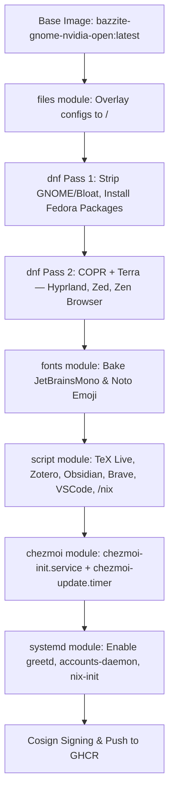
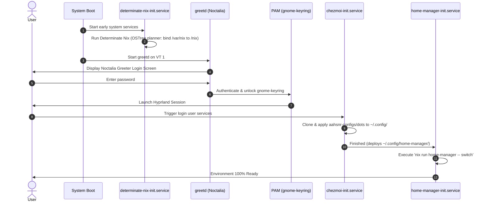

# bazzite-hyprland

A fully declarative, immutable custom OS image built with **[BlueBuild](https://blue-build.org/)** on top of `ghcr.io/ublue-os/bazzite-gnome-nvidia-open:latest`.

This image transforms Bazzite's GNOME + NVIDIA base into a bleeding-edge **Hyprland** Wayland desktop with **Noctalia Greeter**, baked-in TeX Live, Obsidian, Zotero, and fully automated dotfiles and package management via **Chezmoi**, **Determinate Nix**, and **Home-Manager** — with zero manual post-install configuration required on first boot.

---

## Table of Contents

1. [Architecture Overview](#architecture-overview)
2. [Design Principles](#design-principles)
3. [Repository Structure](#repository-structure)
4. [Build Lifecycle](#build-lifecycle)
5. [Runtime Lifecycle: First Boot & Login](#runtime-lifecycle-first-boot--login)
6. [Package Management Strategy](#package-management-strategy)
7. [System Environment & Default Applications](#system-environment--default-applications)
8. [System Management via `ujust`](#system-management-via-ujust)
9. [Dotfiles with Chezmoi](#dotfiles-with-chezmoi)
10. [Troubleshooting & Recovery](#troubleshooting--recovery)
11. [Architectural Q&A](#architectural-qa)
12. [Installation & Rebasing](#installation--rebasing)
13. [Local Development & Testing](#local-development--testing)

---

## Architecture Overview



---

## Design Principles

1. **Zero Runtime Setup** — When rebasing an existing Fedora Silverblue / Kinoite / Bazzite installation to this image, everything is immediately ready upon first login with no manual setup steps.
2. **OSTree Immutability** — `/` and `/usr` are read-only at runtime (`composefs`). All stateful data lives under `/var` (which is excluded from image commits) or `$HOME`. This drives many architectural decisions in this project.
3. **Repository Cleanliness** — All external package repositories (COPR, Terra, Brave, Microsoft) are temporarily enabled during the image build and strictly disabled/removed before the image is exported (`cleanup: true` or `enabled=0`).
4. **Lean Image Footprint** — All DNF transactions enforce `install-weak-deps: false` to prevent hundreds of optional recommended packages from bloating the image.
5. **Surgical Package Removal** — Package removals target specific names and globs rather than broad wildcards to avoid accidentally removing shared libraries (like `gnome-keyring`) that non-GNOME Wayland applications depend on.

---

## Repository Structure

```
.
├── .github/
│   └── workflows/
│       └── build.yml               # GitHub Actions — blue-build/github-action@v1
├── recipes/
│   └── recipe.yml                  # Declarative BlueBuild module pipeline
├── files/
│   ├── scripts/                    # Modular build-time shell scripts
│   │   ├── install-brave.sh        # Brave Browser & Brave Origin
│   │   ├── install-obsidian.sh     # Obsidian AppImage → /usr/lib/obsidian
│   │   ├── install-texlive.sh      # TeX Live (scheme-medium) → /usr/lib/texlive
│   │   ├── install-vscode.sh       # VS Code via Microsoft repo (enabled=0)
│   │   ├── install-zotero.sh       # Zotero → /usr/lib/zotero (auto-update disabled)
│   │   └── setup-nix-base.sh       # Pre-creates /nix mountpoint in root
│   └── system/                     # Filesystem overlay (mapped directly to /)
│       ├── etc/
│       │   ├── greetd/
│       │   │   └── config.toml     # greetd → noctalia-greeter-session
│       │   ├── pam.d/
│       │   │   └── greetd          # PAM stack with gnome-keyring auto-unlock
│       │   ├── profile.d/
│       │   │   └── 00-custom-environment.sh  # XDG, default apps, PATH
│       │   ├── topgrade.toml       # Topgrade config for OSTree (no rpm-ostree upgrades)
│       │   └── yum.repos.d/
│       │       └── vscode.repo     # Microsoft repo (enabled=0 per Bluefin pattern)
│       └── usr/
│           ├── lib/systemd/
│           │   ├── system/
│           │   │   └── determinate-nix-init.service  # First-boot Nix daemon setup
│           │   └── user/
│           │       └── home-manager-init.service     # First-login home-manager switch
│           └── share/ublue-os/just/
│               └── 60-custom.just  # Custom ujust CLI recipes
├── Justfile                        # Local build & development commands
├── SPECIFICATION.md                # Extended specification (archived)
└── TODO.md                         # Implementation tracking
```

---

## Build Lifecycle

Executed on `ubuntu-24.04` in GitHub Actions via `blue-build/github-action@v1`, processing [`recipes/recipe.yml`](recipes/recipe.yml) in strict module order.

### Stage 1 — Files Module

Overlays `files/system/` onto the root filesystem `/` before any packages are touched:

| Deployed Path | Purpose |
|---|---|
| `/etc/greetd/config.toml` | Configures `greetd` to launch `noctalia-greeter-session` |
| `/etc/pam.d/greetd` | PAM stack with `gnome-keyring` auto-unlock on login |
| `/etc/profile.d/00-custom-environment.sh` | System-wide XDG base dirs, default apps, `PATH` |
| `/etc/topgrade.toml` | Topgrade configured for OSTree (no `dnf`/`rpm-ostree` upgrades) |
| `/etc/yum.repos.d/vscode.repo` | Microsoft repo, `enabled=0` (Bluefin pattern) |
| `/usr/lib/systemd/system/determinate-nix-init.service` | First-boot Nix daemon initialization |
| `/usr/lib/systemd/user/home-manager-init.service` | First-login Home-Manager activation |
| `/usr/share/ublue-os/just/60-custom.just` | Custom `ujust` CLI recipes |

### Stage 2 — DNF Pass 1: Strip Bloat & Install Fedora Packages

**Why a dedicated Pass 1?** Packages pinned to official Fedora repositories must be installed before COPR and Terra repos are enabled, preventing version conflicts where COPR/Terra ships incompatible builds of the same package (e.g., Terra ships `neovim` and `mpv`; the Hyprland COPR ships `kitty` and `qt6ct`).

#### Removed Packages

All removals are from the `bazzite-gnome-nvidia-open:latest` base image, audited against its full package manifest:

| Category | Removed Packages | Reason |
|---|---|---|
| **GNOME Shell & Compositor** | `gnome-shell*`, `mutter*`, `gnome-control-center*`, `gnome-session*`, `gnome-initial-setup*`, `gnome-classic-session*`, `gnome-extensions-app*`, `gnome-system-monitor*`, `gnome-remote-desktop*`, `gnome-user-share*`, `gnome-user-docs*`, `gnome-tour*`, `gnome-rounded-blur*`, `gnome-search-yafti*`, `xdg-desktop-portal-gnome*`, `NetworkManager-ssh-gnome`, `rygel`, `gdm` | Replaced entirely by Hyprland + Noctalia Greeter (`greetd`) |
| **Evolution & Epiphany** | `evolution*`, `epiphany-runtime` | EDS background daemons have no utility outside GNOME; WebKitGTK runtime is redundant with Brave/Zen Browser |
| **Redundant Editors & Viewers** | `nano*`, `vim-enhanced`, `vim-common`, `vim-data`, `vim-filesystem`, `ptyxis`, `nautilus*`, `papers*`, `yelp*` | Replaced by Neovim, Kitty, Yazi, standalone Papers, and Zathura. `vim-minimal` is preserved (see Q&A) |
| **Virtualization & Web Consoles** | `virtualbox*`, `cockpit*`, `waydroid*` | Not applicable on a dedicated desktop image |
| **Handheld & Mobile Hardware** | `steamdeck*`, `cardwire*`, `framework-system`, `openrazer*`, `kmod-openrazer*`, `ryzen*`, `ryzenadj*`, `kmod-ryzen*`, `jupiter-sd-mounting-btrfs` | Steam Deck peripherals, Framework laptop tools, Razer drivers, and Ryzen mobile power management are irrelevant on a desktop with NVIDIA |

> **Note on `gnome*` wildcard:** A broad wildcard is deliberately **not used** — it would remove `gnome-keyring` (PAM auto-unlock and secrets storage), `gnome-tweaks` (GTK theming), and shared GTK schemas used by non-GNOME Wayland applications.

> **Note on `vim-minimal`:** It is deliberately **not removed** — Fedora's `sudo` has a hard RPM dependency on `/bin/vi` for `visudo`. Removing `vim-minimal` would abort the DNF transaction or cascade-remove `sudo`. All heavy Vim components are removed; Neovim (`nvim`) is the active editor.

> **Note on `papers*`:** All base image Papers packages are stripped in the remove step (including `papers-nautilus` and `papers-thumbnailer`), then the clean standalone `papers` PDF viewer is immediately reinstalled without Nautilus integration.

#### Installed Packages (Pass 1 — Fedora repos only)

```
accountsservice, bleachbit, bluez, bluez-tools, brightnessctl, cmake,
cronie, curl, ddcutil, direnv, distrobox, fail2ban, file-roller,
fontconfig, fonts-filesystem, gcc-c++, git, gnome-keyring, gnome-tweaks,
go, greetd, grim, gsettings-desktop-schemas, gtk4-layer-shell, gzip,
ImageMagick, imv, inotify-tools, jq, kitty, kitty-shell-integration,
kitty-terminfo, libinput-utils, logrotate, lynis, mpv, neovim,
ninja-build, nodejs, npm, papers, papirus-icon-theme, pipewire,
pipewire-alsa, pipewire-gstreamer, pipewire-pulseaudio, pipewire-utils,
pipx, pkgconf-pkg-config, policycoreutils-python-utils, pymol, qt5ct,
slurp, sqlite, swappy, transmission-gtk, udiskie, xdg-desktop-portal,
xdg-user-dirs, xdg-user-dirs-gtk, xorg-x11-server-Xorg,
xorg-x11-server-Xwayland, zathura, zathura-pdf-poppler, zathura-plugins-all,
nvidia-settings, nvidia-persistenced, egl-wayland, libva-nvidia-driver,
libva-utils, vulkan-tools
```

### Stage 3 — DNF Pass 2: COPR & Terra

External repositories are enabled atomically, packages installed, then `cleanup: true` immediately strips all repository files from `/etc/yum.repos.d/`:

| Repository | Package(s) Installed |
|---|---|
| `lionheartp/Hyprland` COPR | `hyprland-git`, `noctalia-git`, `noctalia-greeter-git`, `nwg-look`, `cliphist`, `qt6ct`, `xdg-desktop-portal-hyprland` |
| `sneexy/zen-browser` COPR | `zen-browser` |
| `lilay/topgrade` COPR | `topgrade` |
| `terra.repo` | `zed` (only this package from Terra) |

> **Important:** `hyprland-devel` must **not** be installed alongside `hyprland-git`. The COPR package bundles its own C++ headers; the Fedora `hyprland-devel` package causes a file conflict. `cliphist` and `qt6ct` must come from the Hyprland COPR for correct Wayland integration.

### Stage 4 — Fonts

The BlueBuild `fonts` module bakes font families into `/usr/share/fonts/` at build time, making them immediately available at the greeter, desktop session, and terminals — no runtime downloads:

- **Nerd Fonts**: `JetBrainsMono`, `NerdFontsSymbolsOnly`
- **Google Fonts**: `JetBrains Mono`, `Noto Emoji`, `Noto Color Emoji`

### Stage 5 — Scripts

Build-time shell scripts in `files/scripts/` execute sequentially:

| Script | What it does |
|---|---|
| `setup-nix-base.sh` | Creates the empty `/nix` directory mountpoint in the read-only root |
| `install-vscode.sh` | Imports Microsoft GPG key, writes `vscode.repo` with `enabled=0`, installs `code` via `--enablerepo=code` |
| `install-brave.sh` | Adds Brave repo + GPG key, installs `brave-browser` and `brave-origin`, removes the repo file |
| `install-texlive.sh` | Downloads CTAN installer; runs non-interactive TeX Live (`scheme-medium`) install to `/usr/lib/texlive`; runs `tlmgr install` for `EXTRA_TL_PACKAGES` |
| `install-zotero.sh` | Extracts Zotero `.tar.xz` to `/usr/lib/zotero`, symlinks `/usr/bin/zotero`, installs `.desktop` entry, writes `policies.json` disabling auto-updates |
| `install-obsidian.sh` | Downloads Obsidian AppImage, extracts SquashFS to `/usr/lib/obsidian`, symlinks `/usr/bin/obsidian`, installs `.desktop` entry and 512×512 icon |

#### Adding Build-Time TeX Live Packages

Edit the `EXTRA_TL_PACKAGES` array at the top of [`files/scripts/install-texlive.sh`](files/scripts/install-texlive.sh):

```bash
EXTRA_TL_PACKAGES=(
  latexmk
  biber
  # add more packages here
)
```

Since `/usr/lib/texlive` is read-only at runtime, post-boot packages install to `~/texmf`:

```bash
tlmgr init-usertree
tlmgr --usermode install <package-name>
# or:
ujust texlive-install <package-name>
```

### Stage 6 — Chezmoi

The BlueBuild `chezmoi` module registers two systemd units:

- **`chezmoi-init.service`** — Runs on first login. Clones `https://github.com/aahsnr-configs/dots` and applies dotfiles to `$HOME`, creating `~/.config/home-manager/`.
- **`chezmoi-update.timer`** — Runs daily in the background to keep dotfiles synchronized.

### Stage 7 — Systemd

| Unit | Scope | Purpose |
|---|---|---|
| `greetd.service` | system | Launches Noctalia Greeter on VT 1 at boot |
| `accounts-daemon.service` | system | AccountsService for user account management |
| `determinate-nix-init.service` | system | First-boot Nix initialization (runs once) |
| `home-manager-init.service` | user | First-login Home-Manager activation (after Chezmoi) |

> `gdm.service` does not need explicit disabling — the `gdm` package was removed in Pass 1, so no service file exists.

### Stage 8 — Signing & Push

The image is signed with Sigstore **Cosign** using `${{ secrets.SIGNING_SECRET }}` and pushed to GHCR at `ghcr.io/<username>/bazzite-hyprland:latest`.

---

## Runtime Lifecycle: First Boot & Login



1. **System Boot** — Kernel mounts root filesystem read-only (`composefs`).
2. **Nix Initialization** — `determinate-nix-init.service` checks for `/nix/receipt.json`. On first boot, it runs the Determinate Nix installer with the `ostree` planner: creates persistent `/var/nix`, bind-mounts it to `/nix`, registers `nix.mount` and `nix-daemon`, writes `/nix/receipt.json`. On subsequent boots it exits immediately.
3. **Noctalia Greeter** — `greetd` launches `/usr/bin/noctalia-greeter-session` on VT 1.
4. **Authentication** — User enters password. `/etc/pam.d/greetd` auto-unlocks `gnome-keyring` via `pam_gnome_keyring.so` — no secondary password prompt.
5. **Hyprland Session** — PAM launches the Hyprland compositor.
6. **Dotfiles Sync** — `chezmoi-init.service` clones `aahsnr-configs/dots` and applies dotfiles to `$HOME`, including `~/.config/home-manager/`.
7. **Home-Manager** — `home-manager-init.service` (`After=chezmoi-init.service`) sources the Nix environment and runs `nix run home-manager -- switch` to install and configure the 23 CLI tools:
   > `atuin`, `bat`, `btop`, `cava`, `chafa`, `direnv`, `dust`, `eza`, `fd`, `fzf`, `git`, `gh`, `git-lfs`, `gnuplot`, `lazygit`, `pandoc`, `ripgrep`, `starship`, `tealdeer`, `tmux`, `yazi`, `zellij`, `zsh`
8. **Daily Sync** — `chezmoi-update.timer` keeps dotfiles up to date daily.

---

## Package Management Strategy

| Layer | Tool | Scope | Examples |
|---|---|---|---|
| **System (immutable)** | DNF via BlueBuild | Fedora repos, COPR, Terra, custom repos | `kitty`, `neovim`, `greetd`, `hyprland-git`, `nodejs`, `pipewire` |
| **Standalone Baked Tools** | Script modules | Extracted into `/usr/lib/` or `/usr/bin/` | Obsidian, VSCode, Brave, Zotero, TeX Live (medium), Pyprland (3.4.x) |
| **Pre-baked Homebrew** | Linuxbrew in BlueBuild | Baked in `/usr/share/homebrew/`, deployed on boot | `atuin`, `bat`, `btop`, `bun`, `cava`, `chafa`, `direnv`, `dust`, `eza`, `fd`, `fzf`, `git`, `gh`, `git-lfs`, `gnuplot`, `lazygit`, `pandoc`, `pixi`, `ripgrep`, `starship`, `tealdeer`, `uv`, `yazi`, `zellij` |
| **User Applications** | Flatpak (`scope: user`) | `~/.local/share/flatpak/` from Flathub | User-specified Flatpak apps (Fedora repo purged, upstream flatpaks suppressed) |
| **User environment** | Home-Manager (Nix) | `~/.nix-profile/` — persists across reboots | User-managed Nix flake configurations |
| **Dotfiles** | Chezmoi | `~/.local/share/chezmoi` synced with SSH | `~/.config/` dotfiles from `aahsnr-configs/dots` |

**Upgrade & Maintenance:** Topgrade has been superseded by native [`ujust system-upgrade`](files/system/usr/share/ublue-os/just/60-custom.just), which orchestrates upgrades for all 17 system and userspace tools (Distrobox, fwupd firmware, Flatpak user apps, mandb, Nix, Home-Manager, hyprpm, Cargo, Doom Emacs, VSCode extensions, TLDR, Pixi, Podman containers, uv, Bun, Yazi packages, and custom `zsh-update`).

---

## System Environment & Default Applications

[`files/system/etc/profile.d/00-custom-environment.sh`](files/system/etc/profile.d/00-custom-environment.sh) is sourced system-wide on every login shell. It is POSIX-compliant:

**XDG Base Directories:**
```sh
export XDG_BIN_HOME="$HOME/.local/bin"
export XDG_CACHE_HOME="$HOME/.cache"
export XDG_CONFIG_HOME="$HOME/.config"
export XDG_DATA_HOME="$HOME/.local/share"
export XDG_STATE_HOME="$HOME/.local/state"
```

**Default Applications:**
```sh
export TERMINAL="kitty"
export BROWSER="brave"
export EDITOR="nvim"
export VISUAL="emacsclient -c -a emacs"
export PAGER="bat --paging=always --style=plain"
```

**PATH additions (in ascending priority):**
```
/home/linuxbrew/.linuxbrew/sbin → /home/linuxbrew/.linuxbrew/bin
→ ~/.npm-global/bin → ~/.config/emacs/bin → ~/.local/bin → ~/.cache/.bun/bin
→ ~/.bun/bin → ~/go/bin → ~/.cargo/bin → ~/bin
→ /nix/var/nix/profiles/default/bin → ~/.nix-profile/bin  (highest priority)
```

---

## System Management via `ujust`

Bazzite ships `ujust` as a native CLI task runner. This image extends it with [`/usr/share/ublue-os/just/60-custom.just`](files/system/usr/share/ublue-os/just/60-custom.just):

| Command | Purpose |
|---|---|
| `ujust system-upgrade` | Comprehensive maintenance & upgrade across all 17 userspace package ecosystems (replaces Topgrade) |
| `ujust rebase-to-custom [tag]` | Rebase current system to the custom `bazzite-hyprland` container image (default: `latest`) |
| `ujust setup-doom` | Non-interactively clone, configure, and install personal Doom Emacs environment |
| `ujust setup-nix` | Verify or manually re-run the Determinate Nix installer |
| `ujust update-nix` | Update Nix flake registries and user channels |
| `ujust switch-home-manager` | Re-evaluate and apply `~/.config/home-manager/` |
| `ujust sync-dotfiles` | Pull and apply latest Chezmoi dotfiles immediately |
| `ujust dots-ssh` | Switch Chezmoi source git repository remote from HTTPS to SSH |
| `ujust dots-push [msg]` | Commit and push Chezmoi dotfile changes to GitHub over SSH |
| `ujust dots-status` | Check Chezmoi sync and Git working tree status |
| `ujust update-hyprpm` | Rebuild and reload Hyprland plugins via `hyprpm` |
| `ujust texlive-install <pkg>` | Install a LaTeX package into `~/texmf` (user mode) |
| `ujust texlive-update` | Update all user-installed TeX Live packages |
| `ujust bazzite-cleanup` | Nix garbage collection + Flatpak unused runtimes + journal trim |

---

## Dotfiles with Chezmoi

### How It Works

The BlueBuild `chezmoi` module runs `chezmoi init --apply <repository>` on first user login via a systemd user service. **Selectivity is controlled inside the dots repo, not in `bazzite-hyprland`.**

### Selective File Filtering with `.chezmoiignore`

Create a `.chezmoiignore` file at the root of your `aahsnr-configs/dots` repository:

```text
# .chezmoiignore — glob patterns of paths to exclude from chezmoi apply

# Ignore configs for window managers not used on this machine:
.config/sway/
.config/i3/

# Ignore legacy shell configs:
.bashrc
.bash_profile

# Ignore entire directories:
old-configs/
some-other-app/

# Ignore a specific file:
.config/foo/bar.conf
```

Chezmoi evaluates `.chezmoiignore` on every `chezmoi apply` — only included configs are placed in your home directory.

### Conditional Filtering with Templates

For machine-specific dotfiles, use Chezmoi's template system. Create `.chezmoi.toml.tmpl` in your dots repo root:

```toml
# .chezmoi.toml.tmpl
[data]
  hostname = "{{ .chezmoi.hostname }}"
```

Then in `.chezmoiignore`:

```
{{- if ne .hostname "my-bazzite-machine" }}
some-folder/
{{- end }}
```

### Why Dotfiles Cannot Be Baked Into `$HOME` at Build Time

This is a fundamental OSTree constraint:
- `/home` is a symlink to `/var/home`. `/var` is **never overwritten by image rebases/updates**.
- During GitHub Actions builds, your local user account does not exist.
- `/etc/skel/` files are only copied for **brand-new users** via `useradd` — ignored for existing users rebasing from Fedora Silverblue.

The Chezmoi-on-login approach handles all these constraints while decoupling dotfile updates from 10 GB container image rebuilds.

---

## Troubleshooting & Recovery

### Git Error: `fatal: .git/index: index file smaller than expected`

**Cause:** Race condition between IDE file writes and background Git extensions truncating `.git/index` to 0 bytes.

**Fix:**
```bash
rm -f .git/index && git reset
# or:
ujust fix-git-index
```

**Prevention:** In VS Code / Zed settings:
```json
{
  "git.autorefresh": false,
  "git.fsWatch": false
}
```

### Home-Manager Not Applied (Network Was Offline at First Login)

```bash
ujust switch-home-manager
```

### Adding TeX Live Packages at Runtime

```bash
tlmgr init-usertree
tlmgr --usermode install <package-name>
# or:
ujust texlive-install <package-name>
```

Packages install to `~/texmf` and survive image updates.

### Nix Not Initialized

```bash
ujust setup-nix
```

---

## Architectural Q&A

### Why Ubuntu runners and not Fedora in GitHub Actions?
GitHub-hosted runners support `ubuntu-24.04`, macOS, and Windows — not native Fedora VMs. `blue-build/github-action@v1` is optimized for Ubuntu with host rootless Podman/Buildah, automatic disk space expansion (`maximize_build_space: true`), and Cosign signing integration.

### Why can't Determinate Nix be baked into the image at build time?
Nix requires `/nix/store` to be writable at runtime. If `/nix` were populated during the container build, it would be baked into the read-only `composefs` layer, making all `nix profile install` and `home-manager switch` commands fail with `Read-only file system` errors.

The solution: `determinate-nix-init.service` initializes persistent, writable storage at `/var/nix` on first boot, bind-mounts it to `/nix`, and starts `nix-daemon`. The image pre-bakes the `/nix` mountpoint directory so the bind mount target exists cleanly.

### Why not use a broad `gnome*` wildcard to strip all GNOME packages?
It would inadvertently remove:
- **`gnome-keyring`** — The secrets daemon; `pam_gnome_keyring.so` relies on it to auto-unlock credentials at login. Removing it breaks SSH key management and Git credentials.
- **`gnome-tweaks`** — Explicitly installed for GTK themes, dark mode, and font configuration.
- **`gnome-bluetooth-libs`** — Shared library used by Waybar and other Wayland status bars.
- **Core GTK schemas** (`gnome-desktop`, `gnome-autoar`) — Used by many non-GNOME Wayland applications.

### Why is `vim-minimal` preserved when removing Vim?
In Fedora, `sudo` has a hard RPM dependency on `/bin/vi` (needed by `visudo`). This is satisfied exclusively by `vim-minimal` (~1 MB). If `vim*` were specified in `remove.packages`, DNF would either abort the transaction or cascade-remove `sudo`, permanently locking out administrative access. All full Vim components are removed; the active editor is Neovim (`nvim`).

### Why is `evolution-data-server` removed?
EDS and `evolution-ews` run persistent background D-Bus factories for calendar, contacts, and tasks — designed for GNOME Shell's top-bar calendar and GNOME PIM apps. In a Hyprland + terminal-first environment, these daemons idle in memory consuming resources with no user-facing benefit.

### Why is TeX Live installed to `/usr/lib/texlive` and not `/usr/local/`?
On Fedora Atomic, `/usr/local` is a symlink to `/var/usrlocal`. Content written to `/var` at container build time is only seeded on first deployment and is **never updated on subsequent image rebases** — a TeX Live installed there would become permanently frozen. Installing to `/usr/lib/texlive` places it inside the versioned, immutable `/usr` layer that is replaced cleanly with every image update.

---

## Installation & Rebasing

### 1. Generate a Cosign Key Pair (One-Time Setup)

```bash
COSIGN_PASSWORD="" cosign generate-key-pair
```

Add `cosign.key` as repository secret `SIGNING_SECRET` under **Settings → Secrets and variables → Actions**.

### 2. Initial Rebase

From Fedora Silverblue, Kinoite, or Bazzite:

```bash
# Replace <username> with your GitHub username
sudo rpm-ostree rebase ostree-unverified-registry:ghcr.io/<username>/bazzite-hyprland:latest
sudo systemctl reboot
```

### 3. Switch to Verified Signed Transport

Once booted into your custom image:

```bash
# Import your Cosign public key
sudo cp cosign.pub /etc/pki/containers/bazzite-hyprland.pub

# Rebase to the signed transport
sudo rpm-ostree rebase ostree-image-signed:docker://ghcr.io/<username>/bazzite-hyprland:latest
```

---

## Local Development & Testing

The [`Justfile`](Justfile) provides shortcuts for working on the recipe locally:

```bash
# Validate recipe syntax and all shell script syntax
just check

# Validate BlueBuild recipe against schema only
just validate

# Generate the compiled Containerfile without building
just dry-run

# Build the container image locally (requires Podman/Buildah)
just build

# Switch the running machine to a locally built image (requires root, bootc system)
sudo just switch

# Repair a corrupted .git/index
just fix-git
```
