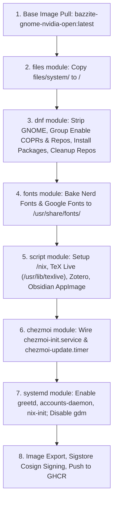

# bazzite-hyprland

A fully baked, declarative custom operating system image built with **[BlueBuild](https://blue-build.org/)**. 

This image transforms **Bazzite's GNOME + NVIDIA** base into an immutable, bleeding-edge **Hyprland** desktop with **Noctalia Greeter**, native development runtimes, TeX Live, Obsidian, Zotero, and automated dotfiles & package management via **Chezmoi**, **Determinate Nix**, and **Home-Manager**.

Everything is baked directly into the image at build time so that when rebasing Fedora Silverblue to this image, **zero manual configuration or post-install steps are needed** on first boot.

---

## Architecture Overview

```
.
├── .github/
│   └── workflows/
│       └── build.yml               # GitHub Actions workflow using blue-build/github-action@v1
├── recipes/
│   └── recipe.yml                  # Declarative BlueBuild image recipe & module pipeline
├── files/
│   ├── scripts/                    # Modular build-time shell scripts
│   │   ├── install-brave.sh        # Installs Brave Browser & Brave Origin
│   │   ├── install-obsidian.sh     # Extracts Obsidian AppImage into /usr/lib/obsidian
│   │   ├── install-texlive.sh      # Installs TeX Live (scheme-medium + tlmgr packages) into /usr/lib/texlive
│   │   ├── install-vscode.sh       # Installs VS Code via Microsoft repo (enabled=0)
│   │   ├── install-zotero.sh       # Installs Zotero to /usr/lib/zotero with policy overrides
│   │   └── setup-nix-base.sh       # Prepares /nix directory mountpoint in image root
│   └── system/                     # Filesystem overlay mapped directly to /
│       ├── etc/
│       │   ├── greetd/
│       │   │   └── config.toml     # greetd configured for noctalia-greeter-session
│       │   ├── pam.d/
│       │   │   └── greetd          # PAM stack with gnome-keyring auto-unlock
│       │   ├── profile.d/
│       │   │   └── 00-custom-environment.sh # System-wide XDG, default apps & PATH variables
│       │   ├── topgrade.toml       # Topgrade tailored for Atomic OS & Home-Manager
│       │   └── yum.repos.d/
│       │       └── vscode.repo     # Microsoft repo (enabled=0 per Bluefin pattern)
│       └── usr/
│           ├── lib/systemd/
│           │   ├── system/
│           │   │   └── determinate-nix-init.service  # First-boot OSTree Nix daemon setup
│           │   └── user/
│           │       └── home-manager-init.service     # First-login home-manager switch
│           └── share/ublue-os/just/
│               └── 60-custom.just  # Native ujust CLI recipes for bazzite-hyprland
├── Justfile                        # Local testing and build commands via BlueBuild CLI
├── SPECIFICATION.md                # Unified master specification & architecture document
├── TODO.md                         # Detailed specification and completion tracking
└── misc.md                         # Architecture decisions (Runner environment)
```

---

## Execution Order: Build-Time & Runtime Lifecycles

To guarantee deterministic, error-free builds and seamless first-login behavior, operations are strictly ordered across two lifecycles:

### 1. Build Lifecycle (GitHub Actions Workflow)

Executed in GitHub Actions on `ubuntu-24.04` via `blue-build/github-action@v1` using [recipes/recipe.yml](file:///home/ahsan/Git/configs/bazzite-hyprland/recipes/recipe.yml):



1. **Base Image Pull**: Begins from `ghcr.io/ublue-os/bazzite-gnome-nvidia-open:latest`.
2. **Files Module**: Overlays `files/system/` onto `/` (Noctalia Greeter configs, PAM stack, Topgrade configuration, and systemd units).
3. **DNF Module**:
   - **Removals**: Strips GNOME Shell, GDM, Mutter, Nautilus, Ptyxis, and GNOME background sessions.
   - **Repository Grouping**: Atomically enables COPRs (`lionheartp/Hyprland`, `sneexy/zen-browser`, `lilay/topgrade`), Brave repo + core key, Microsoft GPG key, and Terra repo (`terra.repo`).
   - **Package Installations**: Installs Hyprland, Noctalia greeter, Brave, Brave Origin, Zen Browser, VSCode (`code`), Zed, C++ build headers (`gcc-c++`, `cmake`, `ninja-build`, `pkgconf-pkg-config`, `git`), Node.js, npm, direnv, and audio/wayland utilities.
   - **Repository Cleanup**: `cleanup: true` immediately disables and removes all external repository files so no unexpected repos remain enabled post-build.
4. **Fonts Module**: Downloads and installs font families system-wide into `/usr/share/fonts/`:
   - `nerd-fonts`: `JetBrainsMono`, `NerdFontsSymbolsOnly`
   - `google-fonts`: `JetBrains Mono`, `Noto Emoji`, `Noto Color Emoji`
5. **Script Module**:
   - `setup-nix-base.sh`: Pre-creates `/nix` directory mountpoint in the read-only root image.
   - `install-texlive.sh`: Downloads official CTAN installer and performs non-interactive installation of TeX Live (scheme-full) into `/usr/lib/texlive` with `/etc/profile.d/texlive.sh`.
   - `install-zotero.sh`: Extracts official Zotero tarball into `/usr/lib/zotero`, creates `/usr/bin/zotero`, installs desktop launcher, and writes `distribution/policies.json` to disable internal self-updates.
   - `install-obsidian.sh`: Downloads official Obsidian AppImage, extracts SquashFS into `/usr/lib/obsidian`, symlinks `/usr/bin/obsidian`, and integrates `.desktop` file and application icon into `/usr/share/`.
6. **Chezmoi Module**: Configures `https://github.com/aahsnr-configs/dots` with `file-conflict-policy: replace` and `all-users: true`. Automatically registers `chezmoi-init.service` and daily `chezmoi-update.timer`.
7. **Systemd Module**: Enables `greetd.service`, `accounts-daemon.service`, and `determinate-nix-init.service`; disables `gdm.service`; enables `home-manager-init.service` for user sessions.
8. **Signing & Registry Push**: Image is signed with Cosign (`${{ secrets.SIGNING_SECRET }}`) and published to GHCR.

---

### 2. Runtime Lifecycle (First Boot & Login)

Executed automatically when booting and logging into the machine:


1. **System Boot**: The kernel boots with the read-only OSTree/bootc root filesystem.
2. **Nix Daemon Bootstrap**: `determinate-nix-init.service` detects that `/nix/receipt.json` does not yet exist. It executes the Determinate Nix installer with the `ostree` planner:
   - Sets up persistent storage in `/var/nix`.
   - Starts `nix.mount` (bind-mounting `/var/nix` to `/nix`).
   - Starts `nix-daemon.socket` and `nix-daemon.service`.
   - Writes `/nix/receipt.json` (so this service never runs again).
3. **Noctalia Greeter**: `greetd.service` launches `/usr/bin/noctalia-greeter-session`.
4. **User Authentication**: The user logs in. `/etc/pam.d/greetd` automatically unlocks the `gnome-keyring` session without secondary password prompts.
5. **Dotfiles Synchronization**: `chezmoi-init.service` runs on first login. It clones `https://github.com/aahsnr-configs/dots` and applies dotfiles into `$HOME`, including `~/.config/home-manager/`.
6. **Home-Manager Provisioning**: `home-manager-init.service` (`After=chezmoi-init.service`) detects that dotfiles are in place and triggers `nix run home-manager -- switch`. This provisions the 23 requested CLI utilities:
   - `atuin`, `bat`, `btop`, `cava`, `chafa`, `direnv`, `dust`, `eza`, `fd`, `fzf`, `git`, `gh`, `git-lfs`, `gnuplot`, `lazygit`, `pandoc`, `ripgrep`, `starship`, `tealdeer`, `tmux`, `yazi`, `zellij`, `zsh`.
7. **Recurring Sync**: `chezmoi-update.timer` runs daily in the background to keep dotfiles synchronized with the upstream repository.

---

## Key Technical Decisions & Fixes

### 1. TeX Live on Immutable OSTree
- **Issue**: Installing into `/usr/local/texlive` breaks on Fedora Atomic because `/usr/local` is a symlink to `/var/usrlocal`. Content written to `/var` at container build time is only seeded on first deployment and is **never updated on subsequent image rebases**.
- **Fix**: TeX Live is installed to `/usr/lib/texlive` (using `scheme-medium`), a genuine, versioned part of `/usr` that updates cleanly with every image build. `/etc/profile.d/texlive.sh` sets `PATH`, `MANPATH`, and `INFOPATH`.
- **Individual Package Management**:
  - **Build-Time Packages**: Add package names to `EXTRA_TL_PACKAGES=( ... )` inside [`files/scripts/install-texlive.sh`](file:///home/ahsan/Git/configs/bazzite-hyprland/files/scripts/install-texlive.sh). These packages are baked into the immutable image via `tlmgr install` during build.
  - **Runtime Post-Boot Packages**: Since `/usr/lib/texlive` is read-only at runtime, install additional packages into your personal user tree without root permissions:
    ```bash
    tlmgr init-usertree
    tlmgr --usermode install <package-name>
    ```
    This installs packages to `~/texmf`, fully preserved across image updates.

### 2. Fonts Baked at Build-Time
- **Issue**: Relying on Homebrew casks at runtime to install fonts causes significant login delays, fails when network access is restricted, and leaves fonts unavailable for the display manager / greeter.
- **Fix**: The BlueBuild `fonts` module bakes `JetBrainsMono`, `NerdFontsSymbolsOnly`, `JetBrains Mono`, `Noto Emoji`, and `Noto Color Emoji` directly into `/usr/share/fonts/` at build time.

### 3. Hyprland Plugins (`hyprpm`) on Atomic Fedora
- **Mechanism**: `hyprpm` compiles plugins in userspace (`~/.local/share/hyprpm/`) against Hyprland C++ headers.
- **Solution**: The image bakes `hyprland-devel`, `gcc-c++`, `cmake`, `ninja-build`, and `pkgconf-pkg-config` directly into the system. `hyprpm update` and `hyprpm add` work out-of-the-box without modifying the host root.

### 4. Topgrade on Atomic Systems
- **Issue**: Topgrade by default runs raw `dnf upgrade` or attempts to touch read-only root paths.
- **Fix**: A curated `/etc/topgrade.toml` disables host package manager steps (`dnf`, `rpm-ostree`, `system`) and enables `home_manager = true`, `flatpak = true`, and `cleanup = true`.

### 5. Determinate Nix: First-Boot Service vs. Build-Time Baking
- **Architectural Requirement**: On Fedora Atomic/OSTree (`composefs`), the root filesystem `/` and `/usr` are mounted strictly **read-only**. However, Nix requires `/nix/store` to be **writable at runtime** so you can install packages, evaluate flakes, and use Home-Manager.
- **Why It Cannot Be Baked into `/nix` at Build Time**: If `/nix` were populated into the root image during container build, it would be baked into the read-only composefs image layer, rendering `nix profile install` and `home-manager switch` non-functional at runtime with `Read-only file system` errors.
- **Solution**: The Determinate Nix `ostree` planner runs via `determinate-nix-init.service` on first boot. It initializes persistent, writable storage on `/var/nix` (since `/var` is the writable partition in OSTree), mounts `/var/nix` to `/nix` via `nix.mount`, and starts `nix-daemon`. The image root pre-bakes the `/nix` directory mountpoint (`files/scripts/setup-nix-base.sh`) so the bind mount point exists cleanly.

### 6. Dotfiles: Chezmoi Selective Configuration vs. Image Baking
- **Why Dotfiles Cannot Be Baked Directly into `$HOME` at Build Time**:
  - In OSTree systems, `/home` is a symlink to `/var/home`.
  - `/var` contains persistent, local user data and is **never overwritten or populated by OSTree image rebases/updates**.
  - During container image build time on GitHub Actions, your local user account does not exist.
  - If dotfiles were placed in `/etc/skel/`, they would only be copied when creating a **brand-new user** via `useradd`. For an **existing user** rebasing from Fedora Silverblue, `/etc/skel` is ignored.
- **Why the BlueBuild Chezmoi Module is the Recommended Standard**:
  - Decouples OS image builds from dotfile tweaks (you don't have to rebuild a 10GB container image just to change a keybinding in Hyprland).
  - Automatically clones and applies your repository (`https://github.com/aahsnr-configs/dots`) on login via `chezmoi-init.service`.
  - Continuously synchronizes updates via `chezmoi-update.timer`.

#### How to Selectively Filter Files and Folders in Chezmoi
To control exactly which files and folders from `aahsnr-configs/dots` are applied to your system, add a `.chezmoiignore` file to the root of your `dots` repository:

```text
# .chezmoiignore (placed in the root of https://github.com/aahsnr-configs/dots)

# Ignore files or directories that you do NOT want applied on this machine:
.bashrc
.bash_profile
legacy-configs/
unwanted-tool/

# Ignore specific desktop environments if your repo contains multiple configs:
.config/sway/
.config/i3/

# You can also use chezmoi templates to conditionally include/exclude:
# {{ if ne .chezmoi.hostname "my-bazzite-laptop" }}
# .config/special-app/
# {{ end }}
```

Chezmoi respects `.chezmoiignore` on every `chezmoi apply`, ensuring only the configs you choose are placed in your home directory.

### 7. DNF Weak Dependencies Disabled
- All DNF module transactions (`recipes/recipe.yml`) explicitly configure `install-weak-deps: false`.
- All custom install scripts (`install-vscode.sh`, `install-brave.sh`) pass `--setopt=install_weak_deps=False`.
- This prevents DNF from installing hundreds of optional recommended packages, keeping the image lean and fast.

### 8. System Environment Variables & Default Applications
- The file [`files/system/etc/profile.d/00-custom-environment.sh`](file:///home/ahsan/Git/configs/bazzite-hyprland/files/system/etc/profile.d/00-custom-environment.sh) is sourced system-wide on login.
- Sets standard XDG directories (`XDG_CONFIG_HOME`, `XDG_DATA_HOME`, etc.).
- Configures default tools: `TERMINAL="kitty"`, `BROWSER="brave"`, `EDITOR="nvim"`, `PAGER="bat"`.
- Prepends user binary directories (`~/.local/bin`, `~/.npm-global/bin`, `~/go/bin`, `~/.cargo/bin`, `~/bin`) and Nix profiles (`~/.nix-profile/bin`, `/nix/var/nix/profiles/default/bin`) to `PATH`.

---

## System Management via `ujust`

Bazzite includes `ujust` as a user-friendly CLI runner. This image ships with [`/usr/share/ublue-os/just/60-custom.just`](file:///home/ahsan/Git/configs/bazzite-hyprland/files/system/usr/share/ublue-os/just/60-custom.just):

| Command | Action |
|---------|--------|
| `ujust setup-nix` | Verify or trigger the Determinate Nix installer |
| `ujust update-nix` | Update Nix flake registries and user channels |
| `ujust switch-home-manager` | Re-evaluate and switch `~/.config/home-manager/` |
| `ujust sync-dotfiles` | Pull and apply latest Chezmoi dotfiles immediately |
| `ujust update-hyprpm` | Rebuild and update Hyprland plugins in userspace |
| `ujust texlive-install <pkg>` | Install a LaTeX package into `~/texmf` (user mode) |
| `ujust texlive-update` | Update all user-installed LaTeX packages |
| `ujust fix-git-index` | Instantly repair corrupted/0-byte `.git/index` |
| `ujust bazzite-cleanup` | Collect Nix garbage (`nix-collect-garbage -d`) and clean system caches |

---

## Unified Master Specification

For complete in-depth documentation, requirement traceability matrix, architectural Q&A, and debugging runbooks, refer to the consolidated master specification:
👉 **[`SPECIFICATION.md`](file:///home/ahsan/Git/configs/bazzite-hyprland/SPECIFICATION.md)**

---

## Installation & Rebasing

### 1. Generate Cosign Key Pair (One-Time Setup)

If you have not already set up image signing, generate a key pair locally:

```bash
COSIGN_PASSWORD="" cosign generate-key-pair
```

Add the private key (`cosign.key`) as a repository secret named `SIGNING_SECRET` under **Settings > Secrets and variables > Actions**.

### 2. Initial Rebase (From Fedora Silverblue)

Rebase your current Fedora Silverblue / Kinoite / Bazzite installation to your custom image:

```bash
# Replace <username> with your GitHub username
sudo rpm-ostree rebase ostree-unverified-registry:ghcr.io/<username>/bazzite-hyprland:latest
```

Reboot your machine:

```bash
sudo systemctl reboot
```

### 3. Switch to Verified Signature Transport

Once booted into your custom image, switch to the verified transport to enforce signature verification:

```bash
# Import your public key
sudo cp cosign.pub /etc/pki/containers/bazzite-hyprland.pub

# Rebase to signed transport
sudo rpm-ostree rebase ostree-image-signed:docker://ghcr.io/<username>/bazzite-hyprland:latest
```

---

## Local Development & Testing

You can validate and build the recipe locally using the BlueBuild CLI or `just`:

```bash
# Validate recipe syntax
just validate

# Build image locally
just build

# Switch running machine to the locally built image (root required)
sudo just switch
```
