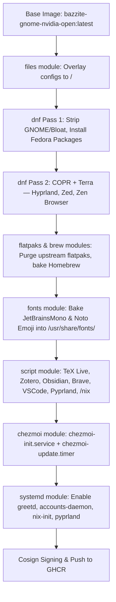
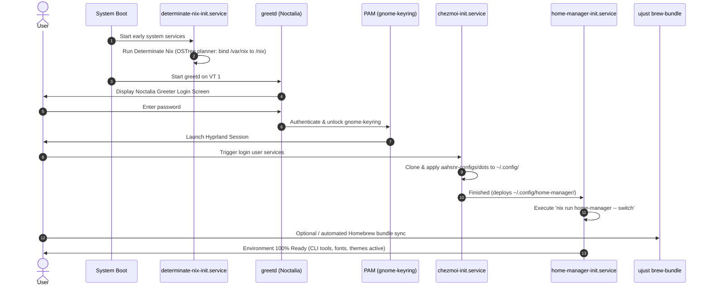

# bazzite-hyprland

A fully declarative, immutable custom OS image built with **[BlueBuild](https://blue-build.org/)** on top of `ghcr.io/ublue-os/bazzite-gnome-nvidia-open:latest`.

This image transforms Bazzite's GNOME + NVIDIA base into a bleeding-edge **Hyprland** Wayland desktop with **Noctalia Greeter**, baked-in TeX Live, Obsidian, Zotero, Pyprland, pre-baked Homebrew, and fully automated dotfiles and package management via **Chezmoi**, **Determinate Nix**, and **Home-Manager** — with zero manual post-install configuration required on first boot.

---

## Table of Contents

1. [Architecture Overview](#architecture-overview)
2. [Design Principles & Immutability Rules](#design-principles--immutability-rules)
3. [Requirements Traceability Matrix](#requirements-traceability-matrix)
4. [Repository Structure](#repository-structure)
5. [Build Lifecycle](#build-lifecycle)
6. [Runtime Lifecycle: First Boot & Login](#runtime-lifecycle-first-boot--login)
7. [Package Management Strategy](#package-management-strategy)
8. [System Environment & Default Applications](#system-environment--default-applications)
9. [System Management via `ujust`](#system-management-via-ujust)
10. [Dotfiles with Chezmoi](#dotfiles-with-chezmoi)
11. [Troubleshooting & Recovery](#troubleshooting--recovery)
12. [Architectural Q&A & Decisions](#architectural-qa--decisions)
13. [Installation & Rebasing](#installation--rebasing)
14. [Local Development & Testing](#local-development--testing)
15. [Verification & Quality Assurance](#verification--quality-assurance)

---

## Architecture Overview



---

## Design Principles & Immutability Rules

1. **Zero Runtime Setup** — When rebasing an existing Fedora Silverblue / Kinoite / Bazzite installation to this image, all runtimes, greeters, desktop environments, fonts, and core tools are immediately ready upon login without running manual host setup steps.
2. **OSTree Immutability Respect** —
   - Root `/` and `/usr` are mounted strictly read-only at runtime via `composefs`.
   - `/var` holds all local, stateful, persistent user data. `/home` is a symlink to `/var/home`.
   - OSTree excludes `/var` from image commits. Therefore, stateful data (such as `/var/nix` and `/var/home`) cannot be pre-seeded into an existing user's home during image build.
3. **Repository Cleanliness** — All external package repositories (COPRs, Terra, Brave, Microsoft) are temporarily enabled during build and strictly disabled or cleaned up before image export (`cleanup: true` or `enabled=0`).
4. **Lean Image Footprint** — All DNF package transactions enforce `--setopt=install_weak_deps=False` (`install-weak-deps: false`) to avoid bloating the image with hundreds of unnecessary weak dependencies.
5. **Surgical Package Removal** — Package removals target specific names and globs rather than broad wildcards (`gnome*`, `vim*`) to avoid accidentally removing shared libraries (like `gnome-keyring`, `gnome-tweaks`, `gnome-bluetooth-libs`) or breaking essential system stubs like `sudo`'s `/bin/vi` dependency (`vim-minimal`).

---

## Requirements Traceability Matrix

All core requirements, architectural decisions, and tasks are implemented and validated:

| # | Requirement | Implementation & Technical Rationale | Status |
|---|-------------|--------------------------------------|--------|
| 1 | **COPR Group Management** | COPR repositories (`lionheartp/Hyprland`, `sneexy/zen-browser`) are grouped in Pass 2 of [`recipes/recipe.yml`](recipes/recipe.yml) with `repos.cleanup: true`, ensuring atomic enablement and removal. | Completed |
| 2 | **Hyprland COPR Packages** | `hyprland-git` from `lionheartp/Hyprland` COPR bundles development headers directly; `hyprland-devel` is omitted to prevent conflict. `cliphist` and `qt6ct` are installed directly from the Hyprland COPR for optimal Wayland integration. | Completed |
| 3 | **Disable Weak Dependencies** | `install-weak-deps: false` is configured across DNF Pass 1 and Pass 2 in [`recipes/recipe.yml`](recipes/recipe.yml), and `--setopt=install_weak_deps=False` is passed in all installation scripts. | Completed |
| 4 | **Brave & Brave Origin** | Installed via dedicated build script ([`files/scripts/install-brave.sh`](files/scripts/install-brave.sh)) using the official repository, core GPG key, and isolated removal post-installation. | Completed |
| 5 | **VSCode (Bluefin Pattern)** | Microsoft GPG key imported, `/etc/yum.repos.d/vscode.repo` written with `enabled=0`, installed via `dnf install --enablerepo=code code` in [`files/scripts/install-vscode.sh`](files/scripts/install-vscode.sh). Repo remains disabled on client. | Completed |
| 6 | **Zen Browser** | Installed via `sneexy/zen-browser` COPR in Pass 2 of [`recipes/recipe.yml`](recipes/recipe.yml). | Completed |
| 7 | **Terra Repo & Zed** | Terra repository is temporarily attached in Pass 2 to install `zed` only; `cleanup: true` strips the repo immediately after the transaction. | Completed |
| 8 | **Determinate Nix & Home-Manager** | Empty `/nix` mountpoint created at build time ([`setup-nix-base.sh`](files/scripts/setup-nix-base.sh)). `determinate-nix-init.service` initializes persistent storage in `/var/nix` via the official `ostree` planner on first boot. `home-manager-init.service` applies user packages on login. | Completed |
| 9 | **Topgrade on Atomic Systems** | Host package manager upgrades (`dnf`, `rpm-ostree`, `system`) disabled in `/etc/topgrade.toml`. Superseded by native `ujust system-upgrade` orchestrating 17 package ecosystems. | Completed |
| 10 | **Hyprland Plugins (`hyprpm`)** | Build headers (`gcc-c++`, `cmake`, `ninja-build`, `pkgconf-pkg-config`, `git`) baked into the image. `hyprpm` builds plugins in userspace (`~/.local/share/hyprpm/`) without requiring root write permissions. | Completed |
| 11 | **Noctalia Greeter & PAM** | Installed `noctalia-greeter-git` from COPR. Configured `/etc/greetd/config.toml` to launch `/usr/bin/noctalia-greeter-session` under user `greeter`. Enabled `greetd.service` and `accounts-daemon.service`. PAM stack configured for `gnome-keyring` auto-unlock. | Completed |
| 12 | **Baked Typography / Fonts** | Removed runtime Homebrew font installation. The BlueBuild `fonts` module bakes `JetBrainsMono`, `NerdFontsSymbolsOnly`, `JetBrains Mono`, `Noto Emoji`, and `Noto Color Emoji` directly into `/usr/share/fonts/` at build time. | Completed |
| 13 | **Obsidian AppImage** | Extracted SquashFS filesystem into `/usr/lib/obsidian` with `/usr/bin/obsidian` symlink, desktop entry, and 512×512 icon via [`files/scripts/install-obsidian.sh`](files/scripts/install-obsidian.sh). | Completed |
| 14 | **Node.js & npm** | Installed exclusively via Fedora default DNF repositories; completely omitted from Homebrew and Nix. | Completed |
| 15 | **Chezmoi Dotfiles & Selective Sync** | BlueBuild `chezmoi` module configured for `https://github.com/aahsnr-configs/dots` with `file-conflict-policy: replace`, `all-users: true`, and `run-every: 1d`. Selectivity controlled via `.chezmoiignore` in dots repo. | Completed |
| 16 | **Service Ordering (Chezmoi before HM)** | Enforced via `home-manager-init.service` with `After=chezmoi-init.service` and `Wants=chezmoi-init.service`. Dotfiles deploy `~/.config/home-manager/` before Home-Manager switches. | Completed |
| 17 | **Home-Manager Packages (23 CLI Tools)** | Manages: `atuin`, `bat`, `btop`, `cava`, `chafa`, `direnv`, `dust`, `eza`, `fd`, `fzf`, `git`, `gh`, `git-lfs`, `gnuplot`, `lazygit`, `pandoc`, `ripgrep`, `starship`, `tealdeer`, `tmux`, `yazi`, `zellij`, `zsh`. Host `direnv` also installed via DNF. | Completed |
| 18 | **TeX Live (`scheme-medium` + Extensibility)** | Installed to `/usr/lib/texlive` with `/etc/profile.d/texlive.sh`. Uses `scheme-medium`. Extensible build-time array `EXTRA_TL_PACKAGES` in [`install-texlive.sh`](files/scripts/install-texlive.sh) runs `tlmgr install`. Post-boot user packages supported via `tlmgr --usermode` and `ujust texlive-install`. | Completed |
| 19 | **Zotero Installation** | Extracted into `/usr/lib/zotero` with `/usr/bin/zotero` symlink, desktop launcher, and `policies.json` disabling auto-updates. Archive extraction handles modern `.tar.xz` transparently. | Completed |
| 20 | **System-Wide Environment Variables** | Added POSIX-compliant `/etc/profile.d/00-custom-environment.sh` configuring XDG base directories, default apps (`kitty`, `brave`, `nvim`), and safely prepending user binaries + Nix/Home-Manager paths to `PATH` via `pathprepend()`. | Completed |
| 21 | **Native `ujust` Task Runner** | Created `/usr/share/ublue-os/just/60-custom.just` providing CLI commands for Nix, Home-Manager, Chezmoi, Hyprpm, TeX Live, Git index repair, Homebrew bundle, and cleanup. | Completed |
| 22 | **Package Manifest Audit & Bloat Removal** | Audited all 1,513 packages in `bazzite-pkgs.txt`. Safely stripped GNOME desktop/session, Evolution Data Server, Epiphany runtime, Nano, full Vim, legacy Papers, VirtualBox guest additions, Cockpit, Waydroid, Cardwire, Framework laptop tools, OpenRazer, and Ryzen mobile power utilities, while preserving NVIDIA, Mesa, PipeWire, Steam, and `sudo`'s `/bin/vi` dependency. | Completed |
| 23 | **Pre-baked Homebrew & Brewfile** | Integrated official BlueBuild `brew` module with `brew-analytics: false` and `auto-upgrade: false`. Deployed system default Brewfile to `/usr/share/ublue-os/Brewfile` and provided `ujust brew-bundle`. | Completed |
| 24 | **Pyprland Daemon & Integration** | Installed Pyprland 3.4.x via pipx into `/usr/lib/pyprland` with `/usr/bin/pyprland` symlink. Configured systemd user service `pyprland.service` enabled at build time. | Completed |
| 25 | **Reversal of `build-gnome-extensions`** | Safely reversed upstream Bazzite's `build-gnome-extensions` via [`clean-gnome-extensions.sh`](files/scripts/clean-gnome-extensions.sh). Purged 12 unneeded extension directories, removed schema overrides, re-compiled GLib schemas, and updated the dconf database. | Completed |

---

## Repository Structure

```
.
├── .github/
│   └── workflows/
│       └── build.yml               # GitHub Actions — blue-build/github-action@v1
├── recipes/
│   └── recipe.yml                  # Declarative BlueBuild module pipeline
├── files/
│   ├── scripts/                    # Modular build-time shell scripts
│   │   ├── clean-gnome-extensions.sh # Reverses Bazzite build-gnome-extensions & cleans schemas
│   │   ├── clean-upstream-flatpaks.sh # Purges Fedora flatpak repo and pre-installed flatpaks
│   │   ├── install-brave.sh        # Brave Browser & Brave Origin
│   │   ├── install-obsidian.sh     # Obsidian AppImage → /usr/lib/obsidian
│   │   ├── install-pyprland.sh     # Pyprland v3.4.x via pipx → /usr/lib/pyprland
│   │   ├── install-texlive.sh      # TeX Live (scheme-medium) → /usr/lib/texlive
│   │   ├── install-vscode.sh       # VS Code via Microsoft repo (enabled=0)
│   │   ├── install-zotero.sh       # Zotero → /usr/lib/zotero (auto-update disabled)
│   │   └── setup-nix-base.sh       # Pre-creates /nix mountpoint in root
│   └── system/                     # Filesystem overlay (mapped directly to /)
│       ├── etc/
│       │   ├── greetd/
│       │   │   └── config.toml     # greetd → noctalia-greeter-session
│       │   ├── pam.d/
│       │   │   └── greetd          # PAM stack with gnome-keyring auto-unlock
│       │   ├── profile.d/
│       │   │   └── 00-custom-environment.sh  # POSIX XDG, default apps, prioritized PATH
│       │   ├── topgrade.toml       # Topgrade config for OSTree (no host upgrades)
│       │   └── yum.repos.d/
│       │       └── vscode.repo     # Microsoft repo (enabled=0 per Bluefin pattern)
│       └── usr/
│           ├── lib/systemd/
│           │   ├── system/
│           │   │   └── determinate-nix-init.service  # First-boot Nix daemon setup
│           │   └── user/
│           │       ├── home-manager-init.service     # First-login home-manager switch
│           │       └── pyprland.service              # User service for Pyprland daemon
│           └── share/ublue-os/
│               ├── Brewfile        # System default Homebrew package bundle (24 packages)
│               └── just/
│                   └── 60-custom.just # Custom ujust CLI recipes
├── Justfile                        # Local build, check, validate & dev commands
├── cosign.pub                      # Public key for Cosign container verification
└── TODO.md                         # Implementation tracking
```

---

## Build Lifecycle

Executed on `ubuntu-24.04` in GitHub Actions via `blue-build/github-action@v1`, processing [`recipes/recipe.yml`](recipes/recipe.yml) in strict module order.

### Stage 1 — Files Module

Overlays `files/system/` onto the root filesystem `/` before any packages are touched:

| Deployed Path | Purpose |
|---|---|
| `/etc/greetd/config.toml` | Configures `greetd` to launch `noctalia-greeter-session` under user `greeter` |
| `/etc/pam.d/greetd` | PAM stack with `gnome-keyring` auto-unlock on login (`pam_gnome_keyring.so`) |
| `/etc/profile.d/00-custom-environment.sh` | System-wide POSIX XDG base dirs, default apps, and prioritized `PATH` |
| `/etc/topgrade.toml` | Topgrade configured for OSTree (host `dnf`/`rpm-ostree` upgrades disabled) |
| `/etc/yum.repos.d/vscode.repo` | Microsoft repo with `enabled=0` (Bluefin pattern) |
| `/usr/lib/systemd/system/determinate-nix-init.service` | First-boot Nix daemon initialization service |
| `/usr/lib/systemd/user/home-manager-init.service` | First-login Home-Manager activation user service |
| `/usr/lib/systemd/user/pyprland.service` | User service managing Pyprland Wayland companion daemon |
| `/usr/share/ublue-os/Brewfile` | System default Homebrew bundle manifest |
| `/usr/share/ublue-os/just/60-custom.just` | Custom `ujust` CLI recipes |

### Stage 2 — DNF Pass 1: Strip Bloat & Install Fedora Packages

**Why a dedicated Pass 1?** Packages pinned to official Fedora repositories must be installed before COPR and Terra repos are enabled, preventing version conflicts where COPR/Terra ships incompatible builds of the same package (e.g., Terra ships `neovim` and `mpv`; the Hyprland COPR ships `kitty` and `qt6ct`).

#### Removed Packages

All removals are audited against the `bazzite-gnome-nvidia-open:latest` package manifest:

| Category | Removed Packages | Technical Reason |
|---|---|---|
| **GNOME Shell & Compositor** | `gnome-shell*`, `mutter*`, `gnome-control-center*`, `gnome-session*`, `gnome-initial-setup*`, `gnome-classic-session*`, `gnome-extensions-app*`, `gnome-system-monitor*`, `gnome-remote-desktop*`, `gnome-user-share*`, `gnome-user-docs*`, `gnome-tour*`, `gnome-rounded-blur*`, `gnome-search-yafti*`, `xdg-desktop-portal-gnome*`, `NetworkManager-ssh-gnome`, `rygel`, `gdm` | Replaced entirely by Hyprland + Noctalia Greeter (`greetd`). |
| **Evolution & Epiphany** | `evolution*` (`evolution-data-server`, `evolution-ews`), `epiphany-runtime` | EDS background daemons run persistent D-Bus factories for GNOME calendar/contacts that idle uselessly in Hyprland; WebKitGTK runtime is redundant with Brave and Zen Browser. |
| **Redundant Editors & Viewers** | `nano*`, `vim-enhanced`, `vim-common`, `vim-data`, `vim-filesystem`, `ptyxis`, `nautilus*`, `papers*`, `yelp*` | Replaced by Neovim, Kitty, Yazi, standalone Papers, and Zathura. `vim-minimal` is preserved (see Architectural Q&A). |
| **Virtualization & Web Consoles** | `virtualbox*`, `cockpit*`, `waydroid*` | Not applicable on a dedicated desktop workstation image. |
| **Handheld & Mobile Hardware** | `steamdeck*`, `cardwire*`, `framework-system`, `openrazer*`, `kmod-openrazer*`, `ryzen*`, `ryzenadj*`, `kmod-ryzen*`, `jupiter-sd-mounting-btrfs` | Steam Deck peripherals, Framework laptop tools, Razer drivers, and Ryzen mobile power management are irrelevant on a desktop with NVIDIA. |

> **Note on `gnome*` wildcard:** A broad wildcard is deliberately **not used** — it would remove `gnome-keyring` (PAM auto-unlock and secrets storage), `gnome-tweaks` (GTK theming), `gnome-bluetooth-libs` (shared library for status bars), and shared GTK schemas used by non-GNOME Wayland applications.
>
> **Note on `vim-minimal`:** It is deliberately **not removed** — Fedora's `sudo` has a hard RPM dependency on `/bin/vi` for `visudo`. Removing `vim-minimal` would abort the DNF transaction or cascade-remove `sudo`. All heavy Vim components are removed; Neovim (`nvim`) is the active editor.
>
> **Note on `papers*`:** Base image Papers packages are stripped in the remove step (including `papers-nautilus` and `papers-thumbnailer`), then the clean standalone `papers` PDF viewer is immediately reinstalled without Nautilus dependencies.

#### Installed Packages (Pass 1 — Fedora Repos Only)

```
accountsservice, bleachbit, bluez-tools, brightnessctl, cargo, cmake, cronie,
curl, ddcutil, direnv, distrobox, emacs-pgtk, fail2ban, file-roller, fontconfig,
fonts-filesystem, gcc-c++, git, gnome-keyring, gnome-tweaks, go, greetd, grim,
gsettings-desktop-schemas, gtk4-layer-shell, gzip, ImageMagick, imv,
inotify-tools, jq, kitty, kitty-shell-integration, kitty-terminfo,
libinput-utils, logrotate, lynis, man-db, mpv, neovim, ninja-build, nodejs, npm,
papers, papirus-icon-theme, pipx, pkgconf-pkg-config, policycoreutils-python-utils,
pymol, qt5ct, slurp, sqlite, swappy, transmission-gtk, tree-sitter-cli, udiskie,
xdg-desktop-portal, xdg-user-dirs, xdg-user-dirs-gtk, xorg-x11-server-Xorg,
xorg-x11-server-Xwayland, zathura, zathura-pdf-poppler, zathura-plugins-all, zsh
```

### Stage 3 — DNF Pass 2: COPR & Terra

External repositories are enabled atomically, packages installed with weak dependencies disabled, then `cleanup: true` immediately strips all repository files from `/etc/yum.repos.d/`:

| Repository | Package(s) Installed |
|---|---|
| `lionheartp/Hyprland` COPR | `hyprland-git`, `noctalia-git`, `noctalia-greeter-git`, `nwg-look`, `cliphist`, `qt6ct`, `xdg-desktop-portal-hyprland` |
| `sneexy/zen-browser` COPR | `zen-browser` |
| `terra.repo` | `zed` (only this package from Terra) |

> **Important:** `hyprland-devel` must **not** be installed alongside `hyprland-git`. The COPR package bundles its own C++ headers; the Fedora `hyprland-devel` package causes a file conflict. `cliphist` and `qt6ct` are installed from the Hyprland COPR for optimal Wayland integration.

### Stage 4 — Flatpaks & Homebrew

- **Flatpaks (`default-flatpaks`)**: Configured for `scope: user` from Flathub. Upstream system flatpaks and the Fedora flatpak remote are cleaned up by [`clean-upstream-flatpaks.sh`](files/scripts/clean-upstream-flatpaks.sh).
- **Homebrew (`brew` module)**: Bakes Linuxbrew into `/usr/share/homebrew/` with `brew-analytics: false` and `auto-upgrade: false`. Seeds the 24 CLI packages via `/usr/share/ublue-os/Brewfile`.

### Stage 5 — Fonts Module

The BlueBuild `fonts` module bakes font families into `/usr/share/fonts/` at build time, making them immediately available at the greeter, desktop session, and terminals with zero runtime downloads:

- **Nerd Fonts**: `JetBrainsMono`, `NerdFontsSymbolsOnly`
- **Google Fonts**: `JetBrains Mono`, `Noto Emoji`, `Noto Color Emoji`

### Stage 6 — Scripts Module

Build-time shell scripts in `files/scripts/` execute sequentially:

| Script | What it does |
|---|---|
| `setup-nix-base.sh` | Creates the empty `/nix` directory mountpoint in the read-only root |
| `clean-upstream-flatpaks.sh` | Purges the Fedora flatpak repository and unneeded upstream flatpak runtimes |
| `clean-gnome-extensions.sh` | Safely reverses Bazzite's `build-gnome-extensions`: removes 12 extension directories, purges schema overrides, and recompiles GLib schemas |
| `install-vscode.sh` | Imports Microsoft GPG key, writes `vscode.repo` with `enabled=0`, installs `code` via `--enablerepo=code` |
| `install-brave.sh` | Adds Brave repo + GPG key, installs `brave-browser` and `brave-origin`, removes the repo file |
| `install-texlive.sh` | Downloads CTAN installer; runs non-interactive TeX Live (`scheme-medium`) install to `/usr/lib/texlive`; runs `tlmgr install` for `EXTRA_TL_PACKAGES` |
| `install-zotero.sh` | Extracts Zotero `.tar.xz` to `/usr/lib/zotero`, symlinks `/usr/bin/zotero`, installs `.desktop` entry, writes `policies.json` disabling auto-updates |
| `install-obsidian.sh` | Downloads Obsidian AppImage, extracts SquashFS to `/usr/lib/obsidian`, symlinks `/usr/bin/obsidian`, installs `.desktop` entry and 512×512 icon |
| `install-pyprland.sh` | Installs Pyprland v3.4.x via pipx into `/usr/lib/pyprland`, creates `/usr/bin/pyprland` symlink, creates `pyprland.service` user unit |

#### Extensibility: Adding Build-Time TeX Live Packages

Edit the `EXTRA_TL_PACKAGES` array at the top of [`files/scripts/install-texlive.sh`](files/scripts/install-texlive.sh):

```bash
EXTRA_TL_PACKAGES=(
  latexmk
  biber
  # add more CTAN packages here
)
```

Since `/usr/lib/texlive` is read-only at runtime, post-boot packages install to `~/texmf`:

```bash
tlmgr init-usertree
tlmgr --usermode install <package-name>
# or simply:
ujust texlive-install <package-name>
```

### Stage 7 — Chezmoi Module

The BlueBuild `chezmoi` module registers two systemd units:
- **`chezmoi-init.service`** — Runs on first login. Clones `https://github.com/aahsnr-configs/dots` and applies dotfiles to `$HOME`, creating `~/.config/home-manager/`.
- **`chezmoi-update.timer`** — Runs daily in the background to keep dotfiles synchronized.

### Stage 8 — Systemd Module

| Unit | Scope | Purpose |
|---|---|---|
| `greetd.service` | system | Launches Noctalia Greeter on VT 1 at boot |
| `accounts-daemon.service` | system | AccountsService for user account management |
| `determinate-nix-init.service` | system | First-boot Nix initialization (runs once, then no-op) |
| `home-manager-init.service` | user | First-login Home-Manager activation (`After=chezmoi-init.service`) |
| `pyprland.service` | user | Pyprland Wayland companion daemon for Hyprland |

> `gdm.service` does not need explicit disabling — the `gdm` package was uninstalled in Pass 1, so no service file exists.

### Stage 9 — Signing & Push

The image is signed with Sigstore **Cosign** using `${{ secrets.SIGNING_SECRET }}` and pushed to GHCR at `ghcr.io/<username>/bazzite-hyprland:latest`.

---

## Runtime Lifecycle: First Boot & Login



1. **System Boot** — Kernel mounts root filesystem read-only (`composefs`).
2. **Nix Initialization** — `determinate-nix-init.service` checks for `/nix/receipt.json`. On first boot, it runs the Determinate Nix installer with the `ostree` planner: creates persistent `/var/nix`, bind-mounts it to `/nix`, registers `nix.mount` and `nix-daemon`, writes `/nix/receipt.json`. On subsequent boots it exits immediately.
3. **Noctalia Greeter** — `greetd` launches `/usr/bin/noctalia-greeter-session` on VT 1.
4. **Authentication** — User enters password. `/etc/pam.d/greetd` auto-unlocks `gnome-keyring` via `pam_gnome_keyring.so` — no secondary password prompt.
5. **Hyprland Session** — PAM launches the Hyprland compositor.
6. **Dotfiles Sync** — `chezmoi-init.service` clones `aahsnr-configs/dots` and applies dotfiles to `$HOME`, including `~/.config/home-manager/`.
7. **Home-Manager Activation** — `home-manager-init.service` (`After=chezmoi-init.service`, `Wants=chezmoi-init.service`) sources the Nix environment and runs `nix run home-manager -- switch` to install and configure the 23 CLI tools:
   > `atuin`, `bat`, `btop`, `cava`, `chafa`, `direnv`, `dust`, `eza`, `fd`, `fzf`, `git`, `gh`, `git-lfs`, `gnuplot`, `lazygit`, `pandoc`, `ripgrep`, `starship`, `tealdeer`, `tmux`, `yazi`, `zellij`, `zsh`
8. **Daily Sync** — `chezmoi-update.timer` keeps dotfiles up to date daily.

---

## Package Management Strategy

| Layer | Tool | Scope | Examples |
|---|---|---|---|
| **System (immutable)** | DNF via BlueBuild | Fedora repos, COPR, Terra, custom repos | `kitty`, `neovim`, `greetd`, `hyprland-git`, `nodejs`, `pipewire` |
| **Standalone Baked Tools** | Script modules | Extracted into `/usr/lib/` or `/usr/bin/` | Obsidian, VSCode, Brave, Zotero, TeX Live (medium), Pyprland (3.4.x) |
| **Pre-baked Homebrew** | Linuxbrew in BlueBuild | Baked in `/usr/share/homebrew/`, deployed on boot | `atuin`, `bat`, `btop`, `bun`, `cava`, `chafa`, `direnv`, `dust`, `eza`, `fd`, `fzf`, `git`, `gh`, `git-lfs`, `gnuplot`, `lazygit`, `pandoc`, `pixi`, `ripgrep`, `starship`, `tealdeer`, `uv`, `yazi`, `zellij` |
| **User Applications** | Flatpak (`scope: user`) | `~/.local/share/flatpak/` from Flathub | User-specified Flatpak apps (Fedora repo purged, upstream flatpaks suppressed) |
| **User Environment** | Home-Manager (Nix) | `~/.nix-profile/` — persists across reboots | User-managed Nix flake configurations |
| **Dotfiles** | Chezmoi | `~/.local/share/chezmoi` synced with SSH | `~/.config/` dotfiles from `aahsnr-configs/dots` |

**Upgrade & Maintenance:** Topgrade has been superseded by native [`ujust system-upgrade`](files/system/usr/share/ublue-os/just/60-custom.just), which orchestrates upgrades for all 17 system and userspace tools: Distrobox, fwupd firmware, Flatpak user apps, mandb, Nix, Home-Manager, hyprpm, Cargo, Doom Emacs, VSCode extensions, TLDR, Pixi, Podman containers, uv, Bun, Yazi packages, and custom `zsh-update`.

---

## System Environment & Default Applications

[`files/system/etc/profile.d/00-custom-environment.sh`](files/system/etc/profile.d/00-custom-environment.sh) is sourced system-wide on every login shell. It is POSIX-compliant and utilizes a safe `pathprepend()` helper to configure search paths:

**XDG Base Directories:**
```sh
export XDG_BIN_HOME="$HOME/.local/bin"
export XDG_CACHE_HOME="$HOME/.cache"
export XDG_CONFIG_HOME="$HOME/.config"
export XDG_DATA_HOME="$HOME/.local/share"
export XDG_STATE_HOME="$HOME/.local/state"
```

**Default Applications:**
```sh
export TERMINAL="kitty"
export BROWSER="brave"
export EDITOR="nvim"
export VISUAL="emacsclient -c -a emacs"
export PAGER="bat --paging=always --style=plain"
```

**Prioritized PATH Additions (evaluated via `pathprepend()`):**
```
/home/linuxbrew/.linuxbrew/sbin → /home/linuxbrew/.linuxbrew/bin
→ ~/.npm-global/bin → ~/.config/emacs/bin → ~/.local/bin → ~/.cache/.bun/bin
→ ~/.bun/bin → ~/go/bin → ~/.cargo/bin → ~/bin
→ /nix/var/nix/profiles/default/bin → ~/.nix-profile/bin  (highest priority)
```

---

## System Management via `ujust`

Bazzite ships `ujust` as a native CLI task runner. This image extends it with [`/usr/share/ublue-os/just/60-custom.just`](files/system/usr/share/ublue-os/just/60-custom.just):

| Command | Purpose |
|---|---|
| `ujust system-upgrade` | Comprehensive maintenance & upgrade across all 17 userspace package ecosystems (replaces Topgrade) |
| `ujust rebase-to-custom [tag]` | Rebase current system to the custom `bazzite-hyprland` container image (default: `latest`) |
| `ujust setup-doom` | Non-interactively clone, configure, and install personal Doom Emacs environment |
| `ujust setup-nix` | Verify or manually re-run the Determinate Nix installer (`determinate-nix-init.service`) |
| `ujust update-nix` | Update Nix flake registries and user channels |
| `ujust switch-home-manager` | Re-evaluate and apply `~/.config/home-manager/` configuration |
| `ujust sync-dotfiles` | Pull and apply latest Chezmoi dotfiles immediately |
| `ujust dots-ssh` | Switch Chezmoi source git repository remote from HTTPS to SSH |
| `ujust dots-push [msg]` | Commit and push Chezmoi dotfile changes to GitHub over SSH |
| `ujust dots-status` | Check Chezmoi sync and Git working tree status |
| `ujust update-hyprpm` | Rebuild and reload Hyprland plugins in userspace via `hyprpm` |
| `ujust texlive-install <pkg>` | Install a LaTeX package into `~/texmf` (user mode) |
| `ujust texlive-update` | Update all user-installed TeX Live packages in `~/texmf` |
| `ujust bazzite-cleanup` | Nix garbage collection + Flatpak unused runtimes + journal trim |
| `ujust brew-bundle` | Install or update all Homebrew packages declared in the Brewfile (`~/.config/Brewfile` or system default) |
| `ujust fix-git-index` | Instantly repair corrupted `.git/index` (`rm -f .git/index && git reset`) |

---

## Dotfiles with Chezmoi

### How It Works

The BlueBuild `chezmoi` module runs `chezmoi init --apply <repository>` on first user login via a systemd user service (`chezmoi-init.service`). It applies all managed files from the repository.

**Selectivity is controlled inside the dots repo (`aahsnr-configs/dots`), not in `bazzite-hyprland`.**

### Selective File Filtering with `.chezmoiignore`

Create a `.chezmoiignore` file at the root of your `aahsnr-configs/dots` repository. Each line is a glob pattern relative to the source directory root:

```text
# .chezmoiignore — patterns of paths to exclude from chezmoi apply

# Ignore configs for window managers not used on this machine:
.config/sway/
.config/i3/

# Ignore legacy shell configs:
.bashrc
.bash_profile

# Ignore entire directories:
old-configs/
some-other-app/

# Ignore a specific file:
.config/foo/bar.conf
```

Chezmoi evaluates `.chezmoiignore` on every `chezmoi apply` — only included configs are placed in your home directory.

### Conditional Filtering with Templates

For machine-specific dotfiles, use Chezmoi's template system. Create `.chezmoi.toml.tmpl` in your dots repo root:

```toml
# .chezmoi.toml.tmpl
[data]
  hostname = "{{ .chezmoi.hostname }}"
```

Then in `.chezmoiignore`:

```
{{- if ne .hostname "my-bazzite-machine" }}
some-folder/
{{- end }}
```

### Why Dotfiles Cannot Be Baked Into `$HOME` at Build Time

This is a fundamental OSTree constraint:
- `/home` is a symlink to `/var/home`. `/var` is **never overwritten by image rebases or updates** to preserve user data.
- During GitHub Actions container image builds, your local user account does not exist.
- `/etc/skel/` files are only copied for **brand-new users** via `useradd` — they are completely ignored for existing users rebasing from Fedora Silverblue, Kinoite, or Bazzite.

The Chezmoi-on-login approach solves all these constraints while decoupling dotfile updates from 10 GB container image rebuilds.

---

## Troubleshooting & Recovery

### Git Error: `fatal: .git/index: index file smaller than expected`

**Cause:** Race condition between IDE file writes and background Git extensions (`git status -z -uall`) truncating `.git/index` to 0 bytes.

**Fix:**
```bash
rm -f .git/index && git reset
# or via ujust / just:
ujust fix-git-index
just fix-git
```

**Prevention:** In VS Code / Zed settings:
```json
{
  "git.autorefresh": false,
  "git.fsWatch": false
}
```

### Home-Manager Not Applied (Network Was Offline at First Login)

```bash
ujust switch-home-manager
```

### TeX Live Runtime Package Additions

Since `/usr/lib/texlive` is read-only at runtime, install new packages into user storage:
```bash
tlmgr init-usertree
tlmgr --usermode install <package-name>
# or simply:
ujust texlive-install <package-name>
```
Packages install to `~/texmf` and survive image updates.

### Nix Not Initialized

```bash
ujust setup-nix
```

### Homebrew Bundle Out of Sync

```bash
ujust brew-bundle
```

---

## Architectural Q&A & Decisions

### Q1: Why Ubuntu runners and not Fedora in GitHub Actions?
* GitHub-hosted runners natively support Ubuntu (`ubuntu-24.04`, `ubuntu-22.04`), macOS, and Windows — not native Fedora VMs.
* Running nested container image builders (Buildah/Podman) inside a Fedora Docker container on CI requires privileged flags and complex cgroup/storage configurations that are fragile in CI environments.
* The official `blue-build/github-action@v1` is specifically optimized for `ubuntu-24.04` with host rootless Podman/Buildah, automatic disk space maximization (`maximize_build_space: true`), and Cosign signing integration.

### Q2: Why cannot Determinate Nix be baked into `/nix` at build time?
* On Fedora Atomic / bootc systems, `/` and `/usr` are mounted strictly **read-only** at runtime (`composefs`).
* Nix requires `/nix/store` to be **writable at runtime** so you can install packages, evaluate flakes, and use Home-Manager.
* If `/nix` were populated into the root image during build, it would be baked into the read-only composefs layer, breaking all runtime Nix commands with `Read-only file system` errors.
* Therefore, `/nix` must be a bind mount to persistent storage on `/var/nix`. Because OSTree excludes `/var` from image commits (to preserve existing user data across updates/rebases), `/var/nix` must be initialized on the target machine on first boot via `determinate-nix-init.service`. The image pre-creates the empty `/nix` mountpoint directory so the bind mount target exists cleanly.

### Q3: Cannot dotfiles be baked into the image itself instead of running at login?
* On OSTree systems, `/home` is a symlink to `/var/home`.
* During an image rebase (e.g. from Fedora Silverblue to this image), `/var` is preserved and **never overwritten by the new image**.
* During container image building in GitHub Actions, your local user account does not exist.
* Files in `/etc/skel/` are only copied when creating a **brand-new user** via `useradd`; they are ignored when an existing user rebases an existing system.
* The BlueBuild `chezmoi` module decouples dotfile updates from 10 GB container image rebuilds, providing automated sync via `chezmoi-update.timer` and templating.

### Q4: How do I selectively choose files and folders from `aahsnr-configs/dots`?
Add a `.chezmoiignore` file to the root of your `aahsnr-configs/dots` repository. Chezmoi evaluates ignore patterns relative to the repository root on every `chezmoi apply`, ensuring only intended configurations are deployed. For machine-specific conditional inclusion, use Chezmoi templates (`.chezmoi.toml.tmpl`).

### Q5: Why not use a broad wildcard like `gnome*` to remove all GNOME packages?
Wildcards in DNF expand across all packages matching the prefix pattern. Specifying `gnome*` would inadvertently match and remove:
1. `gnome-keyring`: Critical system daemon providing secrets storage, SSH key management, and the PAM auto-unlock module (`pam_gnome_keyring.so`) invoked by `greetd`.
2. `gnome-tweaks`: Explicitly installed to configure GTK themes, dark mode preferences, and fonts.
3. `gnome-bluetooth-libs`: Shared library used by Wayland panels and status bars.
4. Core GTK schemas (`gnome-desktop`, `gnome-autoar`) that non-GNOME Wayland applications rely on.

Surgical targeting removes 100% of the GNOME desktop overhead while keeping your secrets vault and theming utilities fully intact.

### Q6: Why is `vim-minimal` preserved when removing Vim?
* In Fedora, the `sudo` package has a hard RPM requirement on `/bin/vi` to support `visudo` (safe editing of `/etc/sudoers`).
* This `/bin/vi` virtual provide is satisfied exclusively by `vim-minimal` (~1 MB).
* If `vim*` were specified in `remove.packages`, DNF would either abort the transaction (`Error: Problem: package sudo requires /bin/vi`) or cascade-remove `sudo`, permanently locking the user out of administrative root access.
* By explicitly removing `vim-enhanced`, `vim-common`, `vim-data`, and `vim-filesystem`, all heavy Vim binaries, runtime scripts, and syntax files are eliminated while preserving the tiny system stub required by `sudo`. The active editor is Neovim (`nvim`), configured in `EDITOR="nvim"`.

### Q7: What is the significance of `evolution*` and why is it removed?
`evolution-data-server` (EDS) and `evolution-ews` provide background calendar, contact, task, and address book factories designed for GNOME Shell's top-bar calendar widget and GNOME PIM apps. In a Hyprland environment with web-based or CLI workflows, EDS runs persistent D-Bus background daemons that consume memory without any user-facing utility. Stripping `evolution*` eliminates this background overhead completely.

### Q8: Why is TeX Live installed to `/usr/lib/texlive` and not `/usr/local/`?
On Fedora Atomic, `/usr/local` is a symlink to `/var/usrlocal`. Content written to `/var` at container build time is only seeded on first deployment and is **never updated on subsequent image rebases** — a TeX Live installed there would become permanently frozen. Installing to `/usr/lib/texlive` places it inside the versioned, immutable `/usr` layer that is replaced cleanly with every image update.

---

## Installation & Rebasing

### 1. Generate a Cosign Key Pair (One-Time Setup)

```bash
COSIGN_PASSWORD="" cosign generate-key-pair
```

Add `cosign.key` as repository secret `SIGNING_SECRET` under **Settings → Secrets and variables → Actions**.

### 2. Initial Rebase

From Fedora Silverblue, Kinoite, or Bazzite:

```bash
# Replace <username> with your GitHub username
sudo rpm-ostree rebase ostree-unverified-registry:ghcr.io/<username>/bazzite-hyprland:latest
sudo systemctl reboot
```

### 3. Switch to Verified Signed Transport

Once booted into your custom image:

```bash
# Import your Cosign public key
sudo cp cosign.pub /etc/pki/containers/bazzite-hyprland.pub

# Rebase to the signed transport
sudo rpm-ostree rebase ostree-image-signed:docker://ghcr.io/<username>/bazzite-hyprland:latest
```

---

## Local Development & Testing

The [`Justfile`](Justfile) provides shortcuts for working on the recipe locally:

```bash
# Validate recipe syntax and all shell script syntax
just check

# Validate BlueBuild recipe against schema only
just validate

# Generate the compiled Containerfile without building
just dry-run

# Build the container image locally (requires Podman/Buildah)
just build

# Switch the running machine to a locally built image (requires root, bootc system)
sudo just switch

# Repair a corrupted .git/index
just fix-git
```

---

## Verification & Quality Assurance

To verify the codebase locally before committing or triggering CI:

```bash
# 1. Shell Script Syntax Validation
bash -n files/scripts/*.sh

# 2. Environment Profile POSIX Compliance Check
sh -n files/system/etc/profile.d/00-custom-environment.sh

# 3. BlueBuild Recipe Schema Validation
just validate
```
