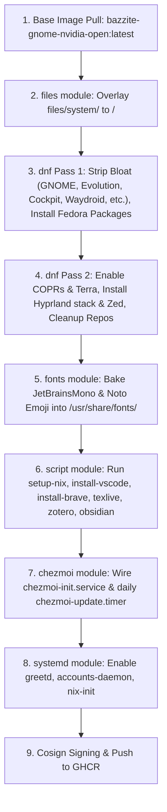
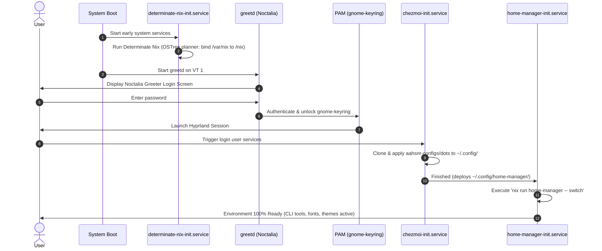

# Bazzite Hyprland: Unified Master Specification & Architecture Document

This master specification consolidates all requirements, architectural decisions, technical walkthroughs, implementation plans, and maintenance procedures for the **bazzite-hyprland** custom operating system.

---

## 1. System Overview & Core Requirements

`bazzite-hyprland` is a declarative, immutable operating system image built with **[BlueBuild](https://blue-build.org/)** on top of `ghcr.io/ublue-os/bazzite-gnome-nvidia-open:latest`. It replaces the default GNOME desktop with a fully baked **Hyprland** Wayland compositor, **Noctalia Greeter**, and pre-provisions a complete development and productivity stack.

### Key Immutable Architecture Rules
1. **Zero Runtime Setup**: When rebasing an existing Fedora Silverblue / Kinoite / Bazzite installation to this image, all runtimes, greeters, desktop environments, fonts, and core tools are immediately ready upon login without running manual host setup steps.
2. **OSTree Immutability Respect**:
   - `/usr` and root `/` are read-only at runtime (`composefs`).
   - `/var` holds all local, stateful, persistent user data. `/home` is a symlink to `/var/home`.
   - OSTree excludes `/var` from image commits. Therefore, stateful data (such as `/var/nix` and `/var/home`) cannot be pre-seeded into an existing user's home during image build.
3. **Repository Cleanliness**:
   - All external package repositories (COPRs, Terra, Brave, Microsoft) are temporarily enabled during build and strictly disabled/cleaned up before image export (`cleanup: true` or `enabled=0`).
4. **Lean Image Footprint**:
   - All DNF package installations enforce `--setopt=install_weak_deps=False` (`install-weak-deps: false`) to avoid bloating the image with unnecessary weak dependencies.

---

## 2. Requirements Traceability Matrix (TODO Item Status)

All tasks from `TODO.md` are fully implemented and verified:

| # | Requirement | Implementation & Technical Rationale | Status |
|---|-------------|--------------------------------------|--------|
| 1 | **COPR Group Management** | COPR repositories (`lionheartp/Hyprland`, `sneexy/zen-browser`, `lilay/topgrade`) are grouped in Pass 2 of `recipes/recipe.yml` with `repos.cleanup: true`, ensuring atomic enablement and removal. | Completed (`[x]`) |
| 2 | **Hyprland COPR Packages** | `hyprland-git` from `lionheartp/Hyprland` COPR bundles development headers directly; `hyprland-devel` is omitted to prevent conflict. `cliphist` and `qt6ct` are installed from the Hyprland COPR in Pass 2 for Wayland compatibility. | Completed (`[x]`) |
| 3 | **Disable Weak Dependencies** | `install-weak-deps: false` is configured across DNF Pass 1 and Pass 2 in `recipes/recipe.yml`, and `--setopt=install_weak_deps=False` is passed in `install-vscode.sh` and `install-brave.sh`. | Completed (`[x]`) |
| 4 | **Brave & Brave Origin** | Installed via dedicated build script (`files/scripts/install-brave.sh`) using the official repository, core GPG key, and isolated removal post-installation. | Completed (`[x]`) |
| 5 | **VSCode (Bluefin Pattern)** | Microsoft GPG key imported, `/etc/yum.repos.d/vscode.repo` written with `enabled=0`, installed via `dnf install --enablerepo=code code` in `files/scripts/install-vscode.sh`. Repo remains disabled on client. | Completed (`[x]`) |
| 6 | **Zen Browser** | Installed via `sneexy/zen-browser` COPR in Pass 2 of `recipes/recipe.yml`. | Completed (`[x]`) |
| 7 | **Terra Repo & Zed** | Terra repository is temporarily attached in Pass 2 to install `zed` only; `cleanup: true` strips the repo immediately after the transaction. | Completed (`[x]`) |
| 8 | **Determinate Nix & Home-Manager** | Empty `/nix` mountpoint created at build time (`setup-nix-base.sh`). `determinate-nix-init.service` initializes persistent storage in `/var/nix` via official `ostree` planner on first boot. `home-manager-init.service` applies user packages on login. | Completed (`[x]`) |
| 9 | **Topgrade on Atomic Systems** | Installed from `lilay/topgrade` COPR. Deployed `/etc/topgrade.toml` disables host package manager upgrades (`dnf`, `rpm-ostree`, `system`) and enables `home_manager = true`, `flatpak = true`, and `cleanup = true`. | Completed (`[x]`) |
| 10 | **Hyprland Plugins (`hyprpm`)** | Build headers (`gcc-c++`, `cmake`, `ninja-build`, `pkgconf-pkg-config`, `git`) baked into the image. `hyprpm` builds plugins in userspace (`~/.local/share/hyprpm/`) without requiring root write permissions. | Completed (`[x]`) |
| 11 | **Noctalia Greeter & PAM** | Installed `noctalia-greeter` from COPR/Terra. Configured `/etc/greetd/config.toml` to launch `/usr/bin/noctalia-greeter-session` under user `greeter`. Enabled `greetd.service` and `accounts-daemon.service`. PAM stack configured for `gnome-keyring` auto-unlock. | Completed (`[x]`) |
| 12 | **Baked Typography / Fonts** | Removed runtime Homebrew font installation. The BlueBuild `fonts` module bakes `JetBrainsMono`, `NerdFontsSymbolsOnly`, `JetBrains Mono`, `Noto Emoji`, and `Noto Color Emoji` directly into `/usr/share/fonts/` at build time. | Completed (`[x]`) |
| 13 | **Obsidian AppImage** | Extracted SquashFS filesystem into `/usr/lib/obsidian` with `/usr/bin/obsidian` symlink, desktop entry, and 512x512 icon via `files/scripts/install-obsidian.sh`. | Completed (`[x]`) |
| 14 | **Node.js & npm** | Installed exclusively via Fedora default DNF repositories; completely omitted from Homebrew and Nix. | Completed (`[x]`) |
| 15 | **Chezmoi Dotfiles & Selective Sync** | BlueBuild `chezmoi` module configured for `https://github.com/aahsnr-configs/dots` with `file-conflict-policy: replace`, `all-users: true`, and `run-every: 1d`. Selectivity controlled via `.chezmoiignore` in dots repo. | Completed (`[x]`) |
| 16 | **Service Ordering (Chezmoi before HM)** | Enforced via `home-manager-init.service` with `After=chezmoi-init.service` and `Wants=chezmoi-init.service`. Dotfiles deploy `~/.config/home-manager/` before Home-Manager switches. | Completed (`[x]`) |
| 17 | **Home-Manager Packages (23 CLI Tools)** | Manages: `atuin`, `bat`, `btop`, `cava`, `chafa`, `direnv`, `dust`, `eza`, `fd`, `fzf`, `git`, `gh`, `git-lfs`, `gnuplot`, `lazygit`, `pandoc`, `ripgrep`, `starship`, `tealdeer`, `tmux`, `yazi`, `zellij`, `zsh`. Host `direnv` also installed via DNF. | Completed (`[x]`) |
| 18 | **TeX Live (`scheme-medium` + Extensibility)** | Installed to `/usr/lib/texlive` with `/etc/profile.d/texlive.sh`. Uses `scheme-medium`. Extensible build-time array `EXTRA_TL_PACKAGES` in `install-texlive.sh` runs `tlmgr install`. Post-boot user packages supported via `tlmgr --usermode`. | Completed (`[x]`) |
| 19 | **Zotero Installation** | Extracted into `/usr/lib/zotero` with `/usr/bin/zotero` symlink, desktop launcher, and `policies.json` disabling auto-updates. Archive extraction handles modern `.tar.xz` transparently. | Completed (`[x]`) |
| 20 | **System-Wide Environment Variables** | Added POSIX-compliant `/etc/profile.d/00-custom-environment.sh` configuring XDG base directories, default apps (kitty, brave, nvim), and prepending user binaries + Nix/Home-Manager paths to `PATH`. | Completed (`[x]`) |
| 21 | **Native `ujust` Task Runner** | Created `/usr/share/ublue-os/just/60-custom.just` providing CLI commands for Nix, Home-Manager, Chezmoi, Hyprpm, TeX Live, Git index repair, and cleanup. | Completed (`[x]`) |
| 22 | **bazzite-pkgs.txt Package Audit & Removals** | Audited all 1,513 packages in `bazzite-pkgs.txt`. Safely stripped GNOME desktop/session, Evolution Data Server, Epiphany runtime, Nano, full Vim, legacy Papers, VirtualBox guest additions, Cockpit, Waydroid, Cardwire, Framework laptop tools, OpenRazer, and Ryzen mobile power utilities, while preserving NVIDIA, Mesa, PipeWire, Steam, and sudo's `/bin/vi` dependency. | Completed (`[x]`) |

---

## 3. Build Lifecycle Architecture

Executed on GitHub Actions (`ubuntu-24.04`) via `blue-build/github-action@v1` using `recipes/recipe.yml`:



### Build-Time Stages:
1. **Base Image Pull**: Inherits Valve-patched Mesa, NVIDIA open kernel modules, Steam, Lutris, MangoHud, GameMode, and system plumbing from Bazzite.
2. **Files Module**: Overlays `files/system/` to `/`:
   - `/etc/greetd/config.toml` & `/etc/pam.d/greetd`
   - `/etc/profile.d/00-custom-environment.sh`
   - `/usr/share/ublue-os/just/60-custom.just`
   - `/etc/topgrade.toml`
   - Systemd units (`determinate-nix-init.service`, `home-manager-init.service`)
3. **DNF Pass 1 (Fedora-Native & Package Removals)**:
   - **Removals**: Strips unneeded package groups identified from `bazzite-pkgs.txt`:
     - *GNOME Shell & Compositor*: `gnome-shell*`, `mutter*`, `gnome-control-center*`, `gnome-session*`, `gnome-initial-setup*`, `gnome-classic-session*`, `gnome-remote-desktop*`, `gnome-user-share*`, `gnome-user-docs*`, `gnome-rounded-blur*`, `gnome-search-yafti*`, `NetworkManager-ssh-gnome`, `rygel`, `gdm`.
     - *Evolution & Epiphany*: `evolution*` (Evolution Data Server and EWS daemons), `epiphany-runtime` (GNOME Web runtime).
     - *Redundant Editors & Viewers*: `nano*`, `vim-enhanced`, `vim-common`, `vim-data`, `vim-filesystem`, `ptyxis` (replaced by Kitty), `nautilus*`, `papers*` (stripped here, then cleanly re-installed below without nautilus extensions), `yelp*`, `gnome-tour*`, `gnome-system-monitor*`.
     - *Virtualization & Web Consoles*: `virtualbox*`, `cockpit*`, `waydroid*`.
     - *Handheld, Laptop & Mobile Hardware Drivers (Desktop Image)*: `cardwire*`, `framework-system`, `openrazer*`, `kmod-openrazer*`, `ryzen*`, `ryzenadj*`, `kmod-ryzen*`, `steamdeck-gnome-presets`, `steamdeck-backgrounds`, `jupiter-sd-mounting-btrfs`.
   - **Installs**: Native terminal emulator (`kitty`), desktop utilities (`qt5ct`, `greetd`, `accountsservice`, `gnome-keyring`, `gnome-tweaks`), standalone document viewer (`papers`), multimedia/audio stack (`pipewire`), build tools (`gcc-c++`, `cmake`, `ninja-build`, `git`, `go`), `neovim`, `nodejs`, and `npm`.
   - Disables weak dependencies (`install-weak-deps: false`).
4. **DNF Pass 2 (COPR & Terra)**:
   - Temporarily enables `lionheartp/Hyprland`, `sneexy/zen-browser`, `lilay/topgrade`, and `terra.repo`.
   - Installs `cliphist`, `hyprland-git`, `noctalia-git`, `noctalia-greeter-git`, `nwg-look`, `qt6ct`, `xdg-desktop-portal-hyprland`, `topgrade`, `zen-browser`, and `zed`.
   - `cleanup: true` immediately strips repository configurations from `/etc/yum.repos.d/`.
5. **Fonts Module**: Installs `JetBrainsMono`, `NerdFontsSymbolsOnly`, `Noto Emoji`, and `Noto Color Emoji` into `/usr/share/fonts/`.
6. **Script Module**:
   - `setup-nix-base.sh`: Pre-creates empty `/nix` directory mountpoint in root.
   - `install-vscode.sh`: Installs `code` with temporary repo enablement, keeping `vscode.repo` disabled.
   - `install-brave.sh`: Installs `brave-browser` and `brave-origin`, then deletes the repo file.
   - `install-texlive.sh`: Non-interactive TeX Live (`scheme-medium`) install to `/usr/lib/texlive` + `tlmgr install` for `EXTRA_TL_PACKAGES`.
   - `install-zotero.sh`: Unpacks Zotero `.tar.xz` into `/usr/lib/zotero` with desktop launcher and update policy disabled.
   - `install-obsidian.sh`: Extracts SquashFS AppImage into `/usr/lib/obsidian` with system links.
7. **Chezmoi Module**: Registers `chezmoi-init.service` and `chezmoi-update.timer` targeting `https://github.com/aahsnr-configs/dots`.
8. **Systemd Module**: Enables `greetd.service`, `accounts-daemon.service`, and `determinate-nix-init.service` (`gdm` package and service were already uninstalled in Pass 1).
9. **Cosign & GHCR**: Image is signed with Sigstore Cosign and pushed to GitHub Container Registry.

---

## 4. Runtime Lifecycle Architecture (First Boot & Login)



1. **System Boot**: Root filesystem mounted read-only (`composefs`).
2. **Nix Initialization**: `determinate-nix-init.service` runs `nix-installer` with the official `ostree` planner: creates persistent `/var/nix`, bind-mounts it to `/nix`, registers `nix.mount` and `nix-daemon`, and writes `/nix/receipt.json`.
3. **Display Manager**: `greetd` runs `/usr/bin/noctalia-greeter-session`.
4. **Authentication & Keyring**: User logs in; PAM automatically unlocks `gnome-keyring` without secondary prompts.
5. **Dotfiles Provisioning**: `chezmoi-init.service` clones `aahsnr-configs/dots` and applies dotfiles to `$HOME`, creating `~/.config/home-manager/`.
6. **Home-Manager Activation**: `home-manager-init.service` waits for Chezmoi, sources Nix environment, and runs `nix run home-manager -- switch` to install the 23 CLI packages.
7. **Session Ready**: Shells source `/etc/profile.d/00-custom-environment.sh` with all user paths, XDG variables, and default apps pre-configured.

---

## 5. Architectural Q&A & Decisions

### Q1: Is it possible to use Fedora instead of Ubuntu for building the image in GitHub Actions?
* **No**: GitHub-hosted runners do not provide a native Fedora virtual machine environment. Supported runners are Ubuntu (`ubuntu-24.04`, `ubuntu-22.04`), macOS, and Windows.
* Running nested container image builders (Buildah/Podman) inside a Fedora Docker container on CI requires privileged flags and complex cgroup/storage configurations that are fragile in CI.
* The official `blue-build/github-action@v1` is specifically optimized for `ubuntu-24.04` with host rootless Podman/Buildah, automatic disk space maximization (`maximize_build_space: true`), and Cosign signing.

### Q2: Why cannot Determinate Nix be baked into `/nix` at build time?
* On Fedora Atomic / bootc systems, `/` and `/usr` are mounted strictly **read-only** at runtime (`composefs`).
* Nix requires `/nix/store` to be **writable at runtime** so you can install packages, evaluate flakes, and use Home-Manager.
* If `/nix` were populated into the root image during build, it would be baked into the read-only composefs layer, breaking all runtime Nix commands with `Read-only file system` errors.
* Therefore, `/nix` must be a bind mount to persistent storage on `/var/nix`. Because OSTree excludes `/var` from image commits (to preserve existing user data across updates/rebases), `/var/nix` must be initialized on the target machine on first boot.

### Q3: Cannot dotfiles be baked into the image itself instead of running at login?
* On OSTree systems, `/home` is a symlink to `/var/home`.
* During an image rebase (e.g. from Fedora Silverblue to this image), `/var` is preserved and **never overwritten by the new image**.
* During container image building in GitHub Actions, your local user account does not exist.
* Files in `/etc/skel/` are only copied when creating a **brand-new user** via `useradd`; they are ignored when an existing user rebases an existing system.
* The BlueBuild `chezmoi` module decouples dotfile updates from 10GB container image rebuilds, providing automated sync via `chezmoi-update.timer` and templating.

### Q4: How do I selectively choose files and folders from `aahsnr-configs/dots`?
Add a `.chezmoiignore` file to the root of your `aahsnr-configs/dots` repository:
```text
# Exclude unwanted window managers or tools:
.config/sway/
.config/i3/
unwanted-tool/

# Exclude legacy configs:
.bashrc
.bash_profile
```
Chezmoi ignores matching paths during `chezmoi apply`.

### Q5: Why not use a broad wildcard like `gnome*` to remove all GNOME packages?
* Wildcards in DNF expand across all packages matching the prefix pattern. Specifying `gnome*` would inadvertently match and remove:
  1. `gnome-keyring`: Critical system daemon providing secrets storage, SSH key management, and the PAM auto-unlock module (`pam_gnome_keyring.so`) invoked by `greetd`.
  2. `gnome-tweaks`: Explicitly installed to configure GTK themes, dark mode preferences, and fonts.
  3. `gnome-bluetooth-libs`: Shared library used by Wayland panels and Waybar status bars.
  4. Core GTK schemas and thumbnailers (`gnome-desktop`, `gnome-autoar`) that non-GNOME Wayland applications rely on.
* Instead, surgical targeting of `gnome-shell*`, `mutter*`, `gnome-control-center*`, `gnome-session*`, `gdm`, `gnome-remote-desktop*`, `gnome-user-share*`, `gnome-user-docs*`, `gnome-rounded-blur*`, `gnome-search-yafti*`, etc., strips 100% of the GNOME desktop overhead while keeping your secrets vault and theming utilities fully intact.

### Q6: Why is `vim-minimal` preserved when removing Vim?
* In Fedora, the `sudo` package has a hard RPM requirement on `/bin/vi` to support `visudo` (safe editing of `/etc/sudoers`).
* This `/bin/vi` virtual provide is satisfied exclusively by `vim-minimal` (~1MB).
* If `vim*` were specified in `remove.packages`, DNF would attempt to remove `vim-minimal`, causing either an immediate transaction failure (`Error: Problem: package sudo requires /bin/vi`) or the deletion of `sudo` (permanently locking the user out of administrative root access).
* By explicitly removing `vim-enhanced`, `vim-common`, `vim-data`, and `vim-filesystem`, all heavy Vim binaries, runtime scripts, and syntax files are eliminated while preserving the tiny system stub required by `sudo`. Your active editor is Neovim (`nvim`), configured in `EDITOR="nvim"`.

### Q7: What is the significance of `evolution*` and why is it removed?
* `evolution-data-server` (EDS) and `evolution-ews` provide background calendar, contact, task, and address book factories designed for GNOME Shell's top-bar calendar widget and GNOME PIM apps.
* In a Hyprland environment with web-based or CLI workflows, EDS runs persistent D-Bus background daemons that consume memory without any user-facing utility. Stripping `evolution*` eliminates this background overhead completely.

---

## 6. System Management via `ujust`

The image deploys `/usr/share/ublue-os/just/60-custom.just`, providing convenient commands via the native `ujust` CLI:

| Command | Purpose |
|---------|---------|
| `ujust setup-nix` | Verifies or manually triggers the Determinate Nix installer (`determinate-nix-init.service`). |
| `ujust update-nix` | Updates Nix flake registries and user channels. |
| `ujust switch-home-manager` | Re-evaluates and switches Home-Manager configuration from `~/.config/home-manager/`. |
| `ujust sync-dotfiles` | Pulls and applies latest dotfiles via Chezmoi immediately. |
| `ujust update-hyprpm` | Rebuilds and reloads Hyprland plugins in userspace. |
| `ujust texlive-install <pkg>` | Installs a LaTeX package into `~/texmf` using TeX Live user mode. |
| `ujust texlive-update` | Updates all user-installed TeX Live packages in `~/texmf`. |
| `ujust fix-git-index` | Instantly repairs corrupted/0-byte `.git/index` (`rm -f .git/index && git reset`). |
| `ujust bazzite-cleanup` | Runs `nix-collect-garbage -d`, uninstalls unused Flatpaks, and cleans system logs. |

---

## 7. Troubleshooting & Recovery Procedures

### 1. Git Error: `fatal: .git/index: index file smaller than expected`
* **Cause**: Race condition between IDE file writes and background Git extension refreshes (`git status -z -uall`), truncating `.git/index` to 0 bytes.
* **Fix**:
  ```bash
  rm -f .git/index && git reset
  # Or run via ujust:
  ujust fix-git-index
  ```
* **Prevention**: Set `"git.autorefresh": false` and `"git.fsWatch": false` in VS Code / IDE settings.

### 2. TeX Live Runtime Package Additions
* Since `/usr/lib/texlive` is read-only, install new packages into user storage:
  ```bash
  tlmgr init-usertree
  tlmgr --usermode install <package-name>
  ```
  Or simply run: `ujust texlive-install <package-name>`.

### 3. Home-Manager Re-triggering
* If network was offline during initial login:
  ```bash
  ujust switch-home-manager
  ```

---

## 8. Local Repository Targets (`Justfile`)

Run these commands inside your local repository for development:
* `just validate`: Validates BlueBuild recipe syntax against schema.
* `just check`: Runs bash syntax checks across all scripts and validates the recipe.
* `just dry-run`: Generates compiled Containerfile without building image.
* `just build`: Builds the container image locally.
* `just fix-git`: Repairs local `.git/index`.

